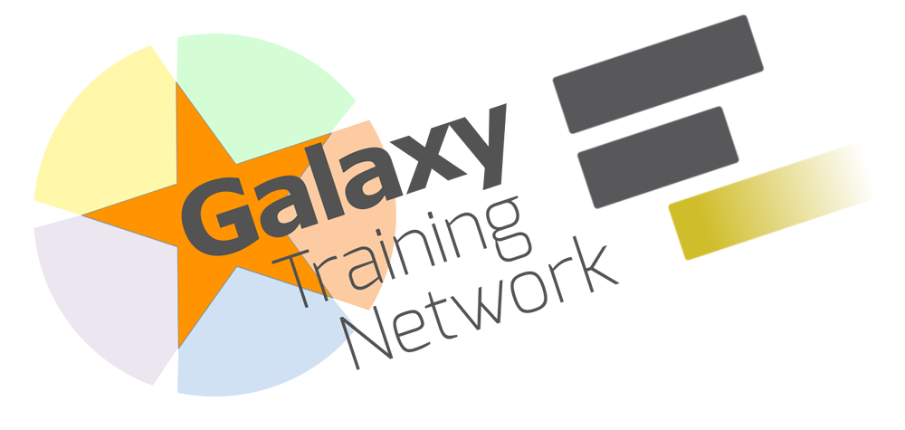

<!-- .slide: data-background="images/title.jpg" data-state="dim-background" -->
## How I developed my career  in data science
### Role models, training, mentoring and community

Bérénice Batut

<small>

University of Freiburg, Germany   
She/her - <i class="fab fa-twitter"></i> <i class="fab fa-github"></i> [@bebatut](twitter.com/bebatut) - <i class="fas fa-envelope"></i> [berenice.batut@gmail.com](mailto:berenice.batut@gmail.com)

MSc Bioinformatics - Bristol UCU - July 2021  
<i class="fas fa-external-link-alt"></i> [bit.ly/bebatut-bristol-ucu-msc-2021](https://bit.ly/bebatut-bristol-ucu-msc-2021)

</small>

Note:
- First of all, I would like to thank the organizers and the committee for giving me the opportunity to give the talk here

---
### How did I develop my career?

 <!-- .element width="50%" -->

Note:
- Where do I come from?
- Family
    - Eldest from 5 children
    - Privileged
    - Parents with both scientific background, long study
    - Mother
        - Passionate about her jobs and taught us the importance of work
        - Biggest role model
- Highschool
    - Know that I wanted to become a researcher
        - No relatives in research
        - No role model to relate
        - Where does it come from?

----
### What did I study?

 <!-- .element width="100%" -->

<i class="fas fa-calendar"></i> 2006-2008: 2 years of Bachelor 
 <i class="fas fa-dot-circle"></i> Mathematics & **Computer science**
 <i class="fas fa-map-marker-alt"></i> University of Lyon

<i class="fas fa-calendar"></i> 2008-2011: Master of Engineering
 <i class="fas fa-dot-circle"></i> **Bioinformatics & modelling**
 <i class="fas fa-map-marker-alt"></i> INSA Lyon

<i class="fas fa-calendar"></i> 2010-2011: Master degree
 <i class="fas fa-dot-circle"></i> Theoretical CS & **Complex system modelling**
 <i class="fas fa-map-marker-alt"></i> ENS Lyon

Note:
- 2008-2011
    - Master of Engineering - Bioinformatics and modelling - INSA Lyon
        - 14 women / 10 men
        - Learn about Python / R
    - Last year in parallel: Master degree - Theoretical computer science - Complex system modelling - ENS Lyon
        - 8 women / 30(?) men in Theoretical computer science 
        - 6 woman / 10 men in Complex system modelling
        - Difficult time but with 5 (female) friends from INSA
            - Still in contact with
            - 2 of them: almost everyday, help each others in our jobs when needed

----
### What about my PhD?

 <!-- .element width="100%" -->

<i class="fas fa-calendar"></i> 2011-2014: PhD

<i class="fas fa-dot-circle"></i> Bacterial reductive genome evolution
 2 aspects to study a same question
- ***In silico* experimental evolution**
- **Comparative genomics / phylogeny**

<i class="fas fa-map-marker-alt"></i> **Computational labs** (LBBE & LIRIS) 
 <small>INSA Lyon</small>

Note:
- 2011-2014
    - Phd student - INSA lyon
    - 2 aspects to study a same question / 2 lab
        - In silico experimental evolution
        - Comparative genomics / phylogeny
    - 4 supervisors
        - 1 women: my role model
        - 1 (male) mentor: help me structure my path in academia
    - Started to work on bigger and collaborative projects
    - Everyday
        - Often the only women
        - Did not feel discriminated
        - Learn a lot

----
### What did I do after my PhD?

 <!-- .element width="100%" -->

<i class="fas fa-calendar"></i> 2015-2016: Postdoc 

<i class="fas fa-dot-circle"></i> **Gut metagenomics**

<i class="fas fa-map-marker-alt"></i> **Wet lab** (CIDAM)
 <small>Université d'Auvergne - Clermont-Ferrand</small>

<i class="fas fa-lock-open"></i> 1st contributions to **Open Source**: [**Galaxy**](https://galaxyproject.org/), [ASaiM](https://asaim.readthedocs.io/en/latest/), First [IUC](https://galaxyproject.org/iuc/) Contribution Fest on Metagenomic Hackathon

<i class="fas fa-chalkboard-teacher"></i> **Training**: [Software Carpentry](https://software-carpentry.org/)

Participation & Talks at computer science meetups

Note:
- 2015-2016
    - Postdoc - Clermont-Ferrand
        - Postdoc as bioinformatician in a biology lab
        - Alone
    - Personal aspect
        - Started to participate to computer science meetups
    - Start contributing to Open Source
        - Partner as mentor
        - New world
            - Impressive
                - Needed to push myself
                - Felt like I have nothing to provide as I was not an expert
                - Get ever my fear that people may think I have nothing to do there (did you feel it was a more opened community that other science meeting/academia ? thus helping to get involved as less depreciated ?)
                - But OSS taught me sth: I can always help, even the tiniest bit, learn step by step and get empowered to become better contributor
            - Curious
        - Galaxy
            - Job opportunity
    - Started to think about my place as a woman in the society
    - Contribution of french collaborative blog on bioinformatics

----
### What do I do now?

 

<i class="fas fa-calendar"></i> 2016-now: Postdoc 

<i class="fas fa-map-marker-alt"></i> [Freiburg Galaxy Team](https://galaxyproject.eu/freiburg/)
 <small>[Bioinformatic / Backofen Lab](http://www.bioinf.uni-freiburg.de/)
 University of Freiburg - [de.NBI](https://www.denbi.de/) - [ELIXIR](https://elixir-europe.org/) Germany</small>

<i class="fas fa-dot-circle"></i> **Data analyses** & **Tool development**
 Microbiome, RNA-seq, etc
 [ASaiM](https://asaim.readthedocs.io/en/latest/), [Galaxy](https://galaxyproject.org/), Python, etc

<i class="fas fa-chalkboard-teacher"></i> **Training**, <i class="fas fa-hands-helping"></i> **Mentoring** & <i class="fas fa-users"></i> **Community**
 [Galaxy Training Network](https://training.galaxyproject.org/), [Gallantries](https://gallantries.github.io/), [ELIXIR Training Platform](https://elixir-europe.org/platforms/training), [Open Life Science](https://openlifesci.org/), [Street Science Community](https://streetscience.community/)

Note:
- 2016-now
    - Postdoc - Freiburg Galaxy team with Björn Grüning
    - de.NBI / ELIXIR
    - Gave up on idea to become Professor
    - Data analysis: RNA-seq, Microbiome - ASaiM
    - Tool development: Microbiome, Galaxy
    - Training, mentoring, community building
    - 

---
### <i class="fas fa-chalkboard-teacher"></i> Training

 <!-- .element width="40%" -->

Note:

Involvement in different training communities

- ELIXIR Training Platform
    - ELIXIR-DE deputy training coordinator
    - ELIXIR TtT
- The Carpentries → Gallantries
- Life science Trainers

----
### Galaxy Training Network for  data analysis training

 <!-- .element class="header_icon" -->

An **online & open infrastructure** to empower scientists and instructors
- [training.galaxyproject.org](https://training.galaxyproject.org/): 210+ tutorials in 20+ topics
- Computational resources: Data / Tools / Servers / TIaaS

A growing **community**
- Thousands of students
- 180+ contributors
- Community events

Note:
- Start to build an online training infrastructure for the Galaxy community
    - Rewamp GTN
    - Strengthen the community with events
- Teaching to empower 
    - users in their analysis
    - new contributors
- Big efforts to learn from different experiences
- ~40K visitors per months

----
### BeerDEcoded for popularization of science

 <!-- .element class="header_icon" -->

![BeerDEcoded workflow on the top. It starts on the left with "Beer" with then an arrow with "Extraction" towards "DNA", an arrow with "Sequencing" towards "DNA sequences", an arrow with "Data analysis" towards "Yeasts". From the "Extraction", an arrow goes to 2 screenshots of the "Beer DNA extraction" protocols. From the "Sequencing", an arrow goes to 2 screenshots of the "Beer DNA sequencing" protocols. From the "Data analysis", an arrow goes to a screenshot to "Beer data analysis" protocol and KRONA output on Galaxy](images/beerdecoded_stuff.png)

An **immersion** into biology, bioinformatics & sciences via beer and their yeasts

Introduction of biology and genomics to a **broad audience**

1-2 days (or divided over several days) **practical workshops**

Detailed & illustrated **protocols** on [Street Science Community](https://streetscience.community) website

Note:
- Reaching people everywhere
- Showing what is research
- Street Science Community
- Funding from Mozilla mini-grants
- BeerDEcoded
    - Pupils and citizens learn about DNA, sequencing technologies, bioinformatics, open science, possible application, and the impact of all of it on everyone's life.
    - Several workshops (pupils, students, etc)

---
### <i class="fas fa-hands-helping"></i> Mentoring

 <!-- .element width="40%" -->

Note:
- Mozilla Open Leaders
    - Participant
        - Opened my eyes on many things 
    - Mentor: Anne → Galaxy for Climate
- The Carpentries
- GTN

----
### Open Life Science = Training + Mentoring

 <!-- .element class="header_icon" -->

 

 <!-- .element width="85%" -->

A 16-week long **personal mentorship** and **cohort-based training** for **Open Science ambassadors**

- OLS-1: 29 participants / 20 projects / 20 mentors / 40+ experts
- OLS-2: 52 participants / 32 projects / 36 mentors / 60+ experts
- OLS-3: 65 participants / 37 projects / 34 mentors / 60+ experts
- OLS-4 (Sep - Jan 2021): **Registration open on [openlifesci.org](https://openlifesci.org/)**

Note:

- A 16-week program
    - 3 cohorts - .. participants - … mentors - … experts
    - Open Science
    - Community building
    - Inclusivity, Empowerment
- Pathways : participants → mentor, experts
- Efforts to choose speakers: women, minorities, entire worlds
- More than just mentoring, a community
    - … members
    - Active Slack with messages everydays
        - Resources
        - Events
        - Job offers
    - Ally skills
    - Developing research oriented topic

---
### <i class="fas fa-users"></i> Community

 <!-- .element width="40%" -->

Note:
Add more logos (microbiome, science, education)

- Involved in different communities
- Learn a lot from them but also the Mozilla Open leaders
- Inclusivity, empowering, pathways, 

Involved in Different communities
GTN
OLS
Street Science Community
Microbiome Galaxy

---
### How does a typical week look like for me?

 <!-- .element width="100%" -->

---
### What did I learn?

 

 <!-- .element width="80%" -->

- Contributing to **openness** can be **frightening** at beginning
- **Mentors** are crucial for all aspects of my life but most important for helping me going **out of my comfort zone** and over my fears
- **Role models**
    - helped me to **project** and to know my possibilities
    - may change overtime: we should **focus on values and traits over people**

Note:

- Contributing to openness can be frightening at beginning
    - I know many people struggle on the openness ...
        - Writing on public issues, in chat rooms
        - contributing code publically
- Mentors are crucial for all aspects of my life but most important for encourage me to go out of my comfort zone and over my fears
    - What about the big topic of self-confidence?
    - anything that you would recommend to others to deal with low self-confidence?
    - what should shy people do?
    - can people that don't like to talk survive in science and build a carear?

    Find a project, community in which you can be mentored, taken step-by-step and empower

- Role models
    - helped me to project and to know my possibilities
    - may change overtime: we should focus on values and traits over people

----
### What did I learn?

 

 <!-- .element width="80%" -->

- People and **communities**
    - made me **reflect on my position and my privileges**
    - got me more familiar with **discrimination and biases**
    - provided insights and solutions for more **accessible, inclusive** communities and resources
- **Sisterhood** helps me in my everyday life

Note:
- People and communities
    - made me reflect on my position and my privileges
    - got me more familiar with discrimination and biases
    - provided insights and solutions for more accessible, inclusive communities and resources
- Sisterhood helps me in my everyday life

---
### What would I like to do in the future?

 

 <!-- .element width="80%" -->

- Analyze data & develop tools
- Keep giving training & building sustainable & accessible training infrastructures
- Participate, sustain & build communities
- Mentor & supervise women
- Participate in initiatives like "Girls in Science"
- Be a role model
- Share my experience
- Keep learning from others!

Note:

- Keep giving training & build sustainable and accessible training infrastructures
    - Not only for rich European but also projects like B3Africa
- I do not feel special. My path is quite "basics" but it is a way to show that it is possible

---
### Thank You!

 <!-- .element width="100%" -->