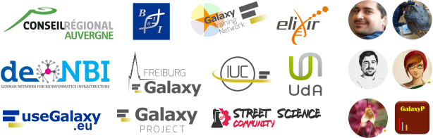

<!-- .slide: data-background="images/title.jpg" data-state="dim-background" -->
## Galaxy for microbiome via ASaiM
### From a local project to a global effort to support microbiome data analysis

### Bérénice Batut

<small>She/her - [@bebatut](twitter.com/bebatut) - berenice.batut@gmail.com - [bit.ly/bebatut-ismb-2020](https://bit.ly/bebatut-bvcn-2021)</small>

Holistic Bioinformatic Approaches used in Microbiome Research - BVCN - June 2021

Note:
- First of all, I would like to thank the organizers, Patricia & Annette, for inviting me to give the talk here
- I was really honored when I received the invitation
- I was not sure what to talk about, I just had some vague idea
- Specially because I am currently in maternity leave since last Christmas
- So I am not really there to follow the many changes in bioinformatics training due to the COVID situation
- I can just witness them, not really an actorthere
- But I thought I could share what I learned over the last (pre-covid) years in the different bioinformatics training communities I was involved in
- How to empower usable and comprehensive bioinformatics training

Thanks for the outline, Bérénice. The committee loves the narrative approach to your outline. We think it’s possible it may not fit into an 1-hour presentation, but think that overall motivation for the development of ASaiM and ASaiM-MT is fundamentally exciting and will be interesting to the conference attendees. We wonder if it’s possible to incorporate the example of the BeerDEcoded project throughout the reasoning for building ASaiM and ASaiM-MT as they currently exist OR excluding the BeerDEcoded project to emphasize which projects/collaborations/relationships drove ASaiM development. And lastly, make sure there is language to help researchers who might be interested in accessing ASaiM on where to find it and any tips to make it useful to their research.

---
### Start (2015-2016)

Context
Postdoc as bioinformatician in a biology lab
Aim of postdoc project: Need to implement a database to compare microbiota data among different projects
Need data to be comparable → need the same workflow to be used, that can be run easily on many samples 
Want to empower researchers in their own analysis
Need to implement solution that they can use on their own data
Test different workflow managers
None filling good criteria (no snakemake, nextflow back then)
Tried to implement something based on makefile and Docker
Too cumbersome, no need to reinvent the wheel
Not user friendly
Galaxy
In my mind back thenat this time: not for bioinformatician, black box, etc
But give it a try
All functionality I needed for workflow
Some tools already there (SortMeRNA, etc)
GUI for users
Idea: ASaiM
Simple Galaxy with only needed tools
Easy to deploy: Docker Galaxy flavor 
Need to do
Integrate missing tools that are used in the lab, and update existing ones
Build workflow
Development of a strong documentation (for users but also contributors)
Opening the horizon: starting to contribute to Galaxy community
Update and add Galaxy tools
Events
GalaxyDayFr
First IUC Contribution Fest on Metagenomic Hackathon (Yvan, Bjoern, etc)
What about the database?
Not enough time.... 
Start of EBI metagenomics / Mgnify

---
### 2016-2017: Less microbiome but more global

Moving to Freiburg Galaxy team
Starting the Galaxy Training Material project
ASaiM
Connection with global community (Saskia, etc)
Full integration of QIIME
Add microbiome tools on Freiburg Galaxy server: available for a larger community
Implement and test workflows (show workflow) on different data
Development of metagenomic training
Local project: Metagenomic assembly for CRISPR subtype discovery
Not Galaxy originally
Difficulties with compute resources
Integration of metagenomic assembly tools into Bioconda and Galaxy
Build workflow for metagenomic assembly

---
### 2018

Publication of ASaiM paper
Metagenomics.usegalaxy.eu
Dedicated interface with European Galaxy server resources
Outreach: kickoff the BeerDEcoded project with the Street Science Community
Yeast DNA extraction and sequencing with MinION directly from a beer bottle
Data analysis with Galaxy
Aim: teaching pupils, general audience about microbiome and data analysis

---
### 2019

Development of new training material for metatranscriptomics (with Galaxy-P)
Connection with an external project: NanoGalaxy
Outreach (Street Science Community): BeerDEcoded
Funding from Mozilla mini-grants
Several workshops (pupils, students, etc)
Development of protocols and online material
Workflow in Galaxy
streetscience.usegalaxy.eu

---
### 2020: year off

Parental leave
ASaiM-MT (with Galaxy-P): new workflow for metatranscriptomic data analysis

---
### 2021 - Future: Toward a global Galaxy Microbiome community

PhD student starting to work on Galaxy Microbiome
Galaxy Microbiome community
Global coordination
Integration of new tools and update of existing ones
Implementation and benchmark of state-of-the-art workflows (MGnify, biobakery, etc)
Integration of new data sources and databases in Galaxy
Outreach (Street Science Community): BeerDEcoded
Implementation of an online game
Workshops with schools, general audience when F2F events possible
Development of Galaxy for outbreak detection from metagenomic sequencing

---

 <!-- .element width="100%" -->

Note:
- Here was my vision for empowering usable and comprehensive bioinformatics training

---
### Thank you!

 <!-- .element width="95%" -->

Note:
- I would like to thank
    - University of Freiburg, Backofen lab and the Freiburg Galaxy team, who I work
    - de.NBI for my funding
    - ELIXIR for the support and the community
- Most of the work I presented here was made by communities I am involved in
    - The Carpentries
    - Life Sci Trainers 
    - Galaxy Training Network
    - Open Life Science 

---
### Thank you!

 <!-- .element width="100%" -->

Note:
- I would like to thank you for listening to this talk