<!-- .slide: data-background="images/title.jpg" data-state="dim-background" -->
## ASaiM
### From a local project to a global effort to support microbiome data analysis

Bérénice Batut

<small>University of Freiburg, Germany   She/her - <i class="fab fa-twitter"></i> <i class="fab fa-github"></i> [@bebatut](twitter.com/bebatut) - <i class="fas fa-envelope"></i> berenice.batut@gmail.com - <i class="fas fa-external-link-alt"></i> [bit.ly/bebatut-bvcn-2021](https://bit.ly/bebatut-bvcn-2021)</small>

<small>Holistic Bioinformatic Approaches used in Microbiome Research - BVCN - June 2021</small>

<small style="position: absolute; right: 0%; font-size: 0.2em; bottom: -20%;">Photo by [Elena Mozhvilo](https://unsplash.com/@miracleday?utm_source=unsplash&utm_medium=referral&utm_content=creditCopyText) on [Unsplash](https://unsplash.com/?utm_source=unsplash&utm_medium=referral&utm_content=creditCopyText) </small>
  

Note:
- First of all, I would like to thank the organizers and the committee for giving me the opportunity to give the talk here

---
<!-- .slide: data-background="images/overview_start.png" data-background-size="contain" data-background-opacity="0.25" -->
## Back in 2015

----
### Context

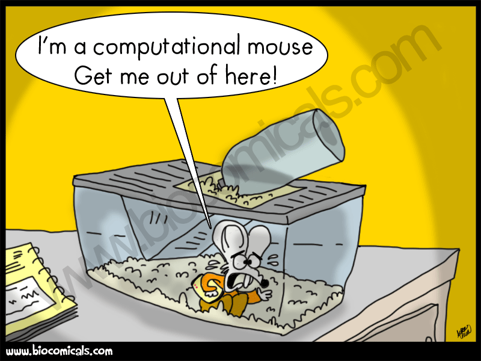 <!-- .element width="70%" -->

<small>Source: [Biocomicals](http://www.biocomicals.com/ind_comicsV2.php?number=20140124)</small>

Note:
- Master in bioinformatics and computer science
- PhD in computational biology labs
- Posdoc
   - bioinformatician in a biology lab

----
### Context of my project
#### Gut microbiota

![Schema illustrating the study of gut microbiota: (1) illustration of the belly of someone with a cloud on it, full of things that looks like micro-organisms, (2) arrow that start from the cloud toward stings, with DNA/RNA written, (3) from the string, one arrow goes towards strings of letters representing sequences, (4) from the sequences one arrow goes towards 3 questions ("Who's there? What are they doing? How are they doing?"). The sequences and questions are inside a red box with on the top "Bioinformatician work" written](images/metagenomics.png) <!-- .element width="70%" -->

Note:
- Community of microorganism species that live in the digestive tracts
- Importance of gut microbiota
    - "Forgotten" organ
- 

----
### Context of my project
#### Gut microbiota: Comparative meta-omic of different project

- Public data repository: [European Nucleotide Archive (ENA)](https://www.ebi.ac.uk/ena/browser/home), [NCBI](https://www.ncbi.nlm.nih.gov/), [DNA Data Bank of Japan (DDBJ)](https://www.ddbj.nig.ac.jp/index-e.html), etc
- Source of information

    "human gut metagenome" search on ENA in 2015

    * 236 studies
    * 1,545 runs, ...

- Dispersed and not comparable information

Note: 
- For a global view
- Public data repository: Source of information

----
### Aim of my project

- Collect gut microbiota datasets in different databases
- Analyze them given a standard workflow

----
### Existing tools

*[QIIME](http://qiime.org/), [Mothur](https://mothur.org/), [MG-RAST](https://www.mg-rast.org/), [MetAMOS](https://metamos.readthedocs.io/en/v1.5rc3/), etc*

But none of them follows all the requirements:

- Analyze datasets given a standard workflow
- Use gut microbiota specific databases
- Combine user-friendly interface and command-line

Note:

few words on QIIME, Mothur

----
 <!-- .element width="50%" -->

An environment to analyze gut microbiota shotgun sequences 

- Expert database combining information from intestinal microbiota
- Modular and user-friendly framework to process and analyze microbiota sequences

----
### ASaiM framework 

- Bioinformatics framework to generate workflows for analyses of gut microbiota data
- Requirements
    - Generation of workflow with numerous tools
    - User-friendly
    - Flexibility and modularity
    - Incorporation of wanted/needed tools and databases

Note:
- Want to empower researchers in their own analysis
- Need to implement solution that they can use on their own data

----
### ASaiM framework 

What I tried 

- Simple Python scripts
- Workflow managers such as Luigi, Airflow, ...
- Homemade approach

![Illustration of the momemade approach. On the left "1. Installation of tools, databases and all dependencies" with below a circle with on the top the logo of Docker and in the circle written PRINSEQ, SortMeRNA, COG, HUMAnN, FastQ-join, MetaPhlAn. In the middle, "2. Generation of a configuration file with pipeline details via a simple Web interface" with a screenshot of the interface, an arrow that goes from the screenshot to a screenshot of a portion of a JSON file. On the right, "3. Running the pipeline via command line" with below a screenshot of 2 commands to run](images/asaim_custom.png)

Note:
- Test different workflow managers
    - None filling good criteria (no snakemake, nextflow back then)
- Tried to implement something based on makefile and Docker
    - Homemade approach:
        1. Installation of tools, databases and all dependencies within Docker
        2. Generation of a configuration file with pipeline details via a simple Web interface
        3. Running the pipeline via command line
    - Too cumbersome, no need to reinvent the wheel
    - Not user friendly

----

<!-- .slide: data-background="images/overview_2015.png" data-background-size="contain" -->

---
<!-- .slide: data-background="images/overview_2015.png" data-background-size="contain" data-background-opacity="0.25" -->
## Building on the shoulder of a giant

Note: 
- highlight year

----
### Galaxy?

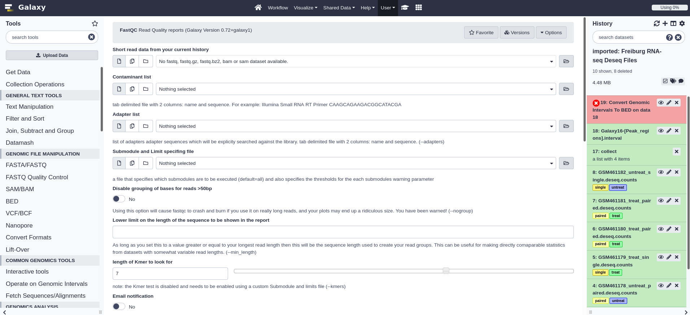 <!-- .element width="100%" -->

Web interface for thousands of bioinformatics tools

Note:
- more details
- No need to know about command line 
- Data
- Tools
- Wrappers
- Possible to interact programmatically with it

----
### Galaxy?

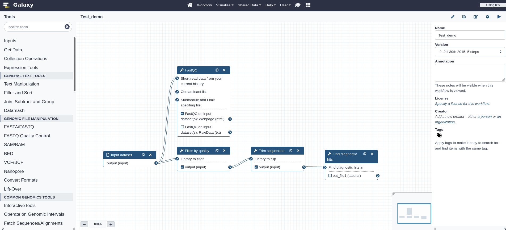 <!-- .element width="100%" -->

Powerful workflow builder and manager

----
### Using Galaxy for ASaiM framework?

 <!-- .element width="65%" -->

<small>Source: [Biocomicals](http://www.biocomicals.com/ind_comicsV2.php?number=20120904)</small>

Note:
- In my mind back then at this time: not for bioinformatician, black box, etc
- But give it a try

----
### Using Galaxy for ASaiM framework?

Fit main requirements
- Generation of workflow with numerous tools
- User-friendly
- Flexibility and modularity
- Possibility to add wanted/needed tools and databases
- Transparency and reproducibility

Note:
- All functionality I needed for workflow
- Some tools already there (SortMeRNA, etc)
- GUI for users

----
### ASaiM framework

![Schema representing the ASaiM framework. On the left, there is a sort of workflow starting with "Raw shotgun sequence data from microbiota" --> "Data upload" --> "Input dataset" --> "Data analyses" --> "Output dataset" --> "Data download" with 4 leaves "Taxonomic information", "Functional information", "Taxonomicall-related functional information", "Comparative analysis results (taxonomy, metabolism or taxonomicall-related metabolism)". Steps from "Data upload" to "Data download" are encapsulated in a big rectangle with "Galaxy instance with a custom configuration" written on the top. 1 arrow with "using" written on it starts from "Data analyses" and goes to a box with blue background labelled "Preconfigured workflows" with 2 boxes with white background in it: (1) "Workflows to analyze raw shotgun sequences from microbiota" with 2 boxes in it: (1.1) "Metagenomic/metatranscriptomic data" with a workflow: "Quality control" --> "Dereplicate" --> 2 branches: "Assign taxonomy (MetaPhlAn)" and "Remove rRNA/rDNA (SortMeRNA) --> Analyze functions (HUMAnN)", that merge in "Combine functional and taxonomic results"; (1.2) "Amplicon data" with a workflow "Control quality" --> "Dereplicate" --> "Extract rDAN (SortMeRNA)" --> "Assign taxonomy (Mothur)"; (2) "Workflows for comparative analyses" with 4 boxes: "Taxonomy", "Gene family/pathway abundances", "GO slim term abundances", "Taxonomically related gene family/pathway abundances". An arrow (with "using" written on it) starts from the "Preconfigured workflows" box toward a another box labelled "222 selected and automatically provisionned tools, organized to help user choices" with 4 boxes insides: (1) "47 manipulation tools" with rectangles "Get Data", "Manipulate files", "Manipulate sequence files", "Manipulate BAM/SAM files"; (2) "16 preprocessing tools" with boxes "Assemble paired-end sequences", "Control quality", "vsearch tool suite", "Cluster sequences", "Sort rRNA/rDNA"; (3) "149 structural and functional analysis tools" with boxes "Map against reference genomes", "Search similarity", "Mothur tool suite", "Analyze metabolism", "Assign taxonomy for all sequence types", "Combine functional and taxonomic results"; (4) "10 visualiszation, statistics and comparative analysis tools" with boxes "Visualize data", "Compute statistics". An arrow starts from the box "222 selected and automatically provisionned tools, organized to help user choices" towards the last box labelled "Imported databases". In this box, there are 3 boxes: (1) "rRNA/rDNA" with 2 boxes "SILVA" and "Rfam"; (2) "Taxonomy" with 1 box "MetaPhlAn2 database"; (3) "Functions" with 2 boxes "ChocoPhlAn" and "UniRef50"](images/asaim_v1.png) <!-- .element width="60%" -->

Note:
- Simple Galaxy with only needed tools
- Need to do
    - Integrate missing tools that are used in the lab, and update existing ones
    - Build workflow

----
### A simplified Galaxy interface

With a comprehensive set of microbiota related tools

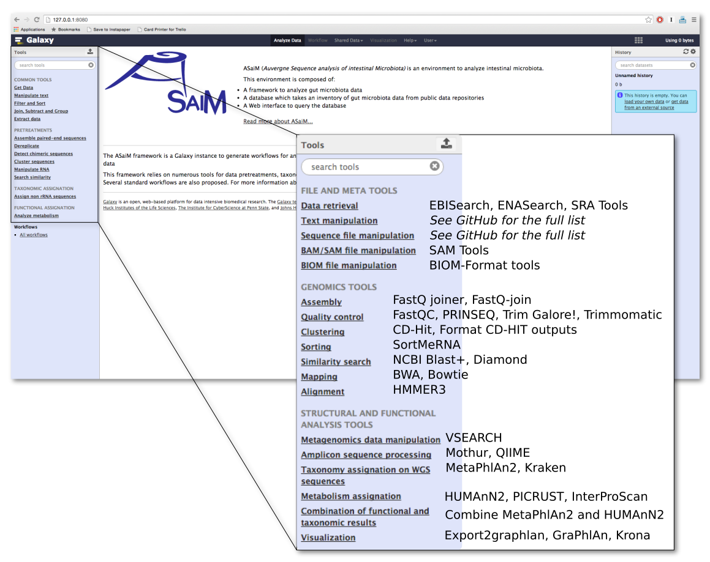 <!-- .element width="70%" -->

Note:
- Simplified interface highlighting only needed tools
- Tools used locally

----
### Predefined and tested workflows

![ASaiM main workflow to analyze raw shotgun metagenomics data. It has 4 parts: PROCESSING (represented yellow boxes), TAXONOMIC ANALYSES (represented by the red boxes), FUNCTIONAL ANALYSES (represented by the purple boxes), FUNCTIONAL AND TAXONOMIC COMBINATION (represented by the green boxes). The workflow starts on the left, in PROCESSING part, from File "Raw reads" / FastQ on the left --> yellow box "Quality control (FastQC) and trimming (TrimGalore!)" --> File "Controlled reads" / Fasta --> yellow box "Dereplication (Vsearch)" --> File "Unique reads" / Fasta. The workflow branch then. (1) On the top, the TAXONOMIC ANALYSIS starts from the File "Unique reads" / Fasta --> red box "Taxonomic assignations (MetaPhlAn)" --> File "Taxa abundance" / Table --> 3 branches (from top to bottom): (1.1) red box "Visualization (GraPhlAn)" --> File "Community structure" / PNG; (1.2) red box "Visualization (KRONA)" --> File "Community structure" / HTML; (1.3) red box "Formatting for the different taxonomic levels" --> Different Files "Taxa abundance for species" / Table. 2 arrows start also from File "Taxa abundance" / Table to 2 boxes in FUNCTIONAL AND TAXONOMIC COMBINATION part. (2) On the bottom, the FUNCTIONAL ANALYSES starts from the File "Unique reads" / Fasta --> yellow box "rRNA/rDNA selection (SortMeRNA)" --> File "Non rRNA/rDNA reads" / Fasta --> purple box "Metabolic assignations (HUMAnN2)" --> 2 branches (from top to bottom): (2.1) File "Pathway abundance" / Table --> green box "Combination of taxonomic and metabolic assignations" --> File "Pathway abundance per taxa" / Table; (2.2) File "Gene family abundance" / Table --> 2 branches (from top to bottom): (2.2.1) green box "Combination of taxonomic and metabolic assignations" --> File "Gene family abundance per taxa" / Table; (2.2.2) purple box "Grouping to high level GO Slim terms" --> File "GOslim term abundance" / Table](images/asaim_main_wf.png) <!-- .element width="100%" -->

Main workflow to analyze raw shotgun metagenomics data

Note:
- Introduce HUMAMnN, MetaPhlAn

----
### An extensive documentation

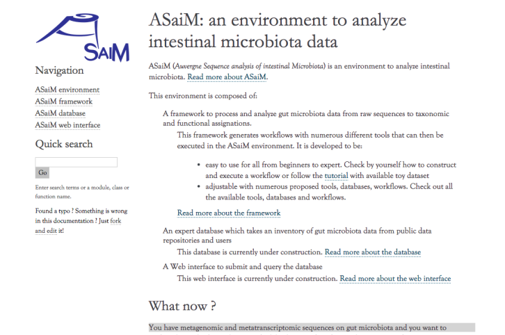

<small>https://asaim.readthedocs.io</small>

Note:
- Development of a strong documentation (for users but also contributors)

----
### Behind the scene

A [GitHub organization](https://github.com/ASaiM/) with

- A repository for tools added the Galaxy Tool Shed
- A repository with Shell scripts to
    1. Get latest revision of Galaxy
    2. Prepare databases and tools
    4. Launch Galaxy
- A repository with the documentation

Note:
- Mention that was my first GitHub repos
- Help Gaalxy admin
- Not straightforward for users

----
### Beyond ASaiM

Starting to contribute to Galaxy project

- 1st contributions to Open Source
- Update and add Galaxy tools
- Participate to community events
    - GalaxyDayFr
    - First IUC Contribution Fest on Metagenomic Hackathon
- Meet folks of the Galaxy community and in particular [Björn Grüning](https://github.com/bgruening) 

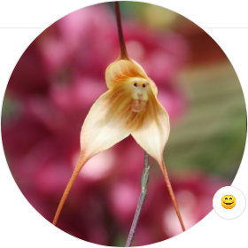 <!-- .element class="header_icon" -->

Note:
- Opening the horizon: starting to contribute to Galaxy community
- Update and add Galaxy tools
- Events
    - GalaxyDayFr
    - First IUC Contribution Fest on Metagenomic Hackathon (Yvan, Björn, etc)
- Oportunity to meet Bjoern Gruening which offers me a job in Freiburg

----
<!-- .slide: data-background="images/overview_2016.png" data-background-size="contain" -->

---
<!-- .slide: data-background="images/overview_2016.png" data-background-size="contain" data-background-opacity="0.25" -->

### Beyond gut microbiota and a local effort

Note:
- 2016
- Less microbiome focused but more global
- Moving to Freiburg Galaxy team
- Starting the Galaxy Training Material project

----
### Coordination of efforts with the Galaxy community

- Work with [Saskia Hiltemann](https://shiltemann.github.io/)
- Global efforts
    - with [Intergalactic Utilities Commission (IUC)](https://galaxyproject.org/iuc/) to 
        - Integrate [QIIME 1.9](http://qiime.org/) and [Mothur](https://mothur.org/) tool suites
        - Develop [Conda](https://docs.conda.io/en/latest/) packages for tools and dependencies
    - with [Galaxy Training Network (GTN)](https://training.galaxyproject.org/) to
        - Develop training

 <!-- .element class="header_icon" -->

Note:
- This effort make possible to deploy tools/workflows on public Galaxy server
- Introduce QIIME and Mothur
- Introduce conda: open source package management system to manage tool installation and their dependencies

----

### Online and community supported training material

 <!-- .element width="90%" -->

<small>[training.galaxyproject.org/topics/metagenomics](training.galaxyproject.org/topics/metagenomics)</small>

Note:
- GTN
- Developped with the help of the Galaxy Training Network (GTN)
- Hosted in the GTN website  
- http://galaxyproject.github.io/training-material/metagenomics
- 16S with Mothur
- Analyses of metagenomics data

----
### Integration of metagenomic assembly 

- Integration of tools
    - metagenomic assembly tools: MEGAHIT, MetaSPAdes, etc
    - assembly quality tools: MetaQUAST, VALET, etc
- Build workflows for metagenomic assembly

![ASaiM workflow to assemble metagenomic data. It has 4 parts with 4 colors (yellow, red, green, purple). The workflow starts, on the left, with 2 Files "Forward raw reads" / FastQ 6 "Reverse raw reads" / FastQ. These files are linked to 2 branches (from top to bottom): (1) yellow box "Quality control (FastQC)" --> 2 output Files "QC report for forward" / Text & "QC report for reverse" / Text --> purple box "Report aggregation (MultiQC)"; (2) yellow box "Quality cleaning (TrimGalore!)" --> 2 outputs Files "Forward controlled reads" / Fasta & "Reverse controlled reads" / Fasta --> 3 branches: (2.1) red box "Assembly (metaSPAdes/MEGAHIT)" --> 2 outputs Files "Scaffolds" / Fasta & "Contigs" / Fasta --> green box "Quality assessment (MetaQUAST)" --> File "Report" --> purple box "Report aggregation (MultiQC)"; (2.2) green box "Validation (VALET)" with also File "Contigs" / Fasta as input --> File "Report"; (2.3) green box "Mapping on original reads (Bowtie2)" with also File "Contigs" / Fasta as input --> File "Mapping stats" --> purple box "Report aggregation (MultiQC)"](images/assembly_wf.png) <!-- .element width="80%" -->

Note:
- Started like an internal project for CRISPR subtype discovery
- Not Galaxy originally
- Difficulties with compute resources
- Integration of metagenomic assembly tools into Bioconda and Galaxy

----
### A framework redistribuable and sharable

- Building on the shoulders of giants
    - [Galaxy ToolShed](https://galaxyproject.org/toolshed/), [Bioblend](https://bioblend.readthedocs.io/en/latest/), and [Ephemeris](https://ephemeris.readthedocs.org): to install the Galaxy tools, the workflows and databases
    - Conda: to install the tools and their dependencies
    - [Docker](https://www.docker.com/): to containerize and ship everything
- Deployment of ASaiM tools and workflows to the Freiburg Galaxy server

Note:
- ToolShed: it serves as an "appstore" to all Galaxies worldwide, and is a free service for tool developers and Galaxy admins to host and share Galaxy utilities
- Bioblend: Python library to interact with Galaxy API
- Ephemeris: Python library and scripts for managing the bootstrapping of Galaxy plugins like tools, index data, and workflows
- Container:
- Docker: 

----
<!-- .slide: data-background="images/overview_2017.png" data-background-size="contain" -->

---
<!-- .slide: data-background="images/overview_2017.png" data-background-size="contain" data-background-opacity="0.25" -->

### Spreading this ressource globally and supporting more microbiome analyses

Note:
- 2018 - 2019

----
### Publication of ASaiM paper

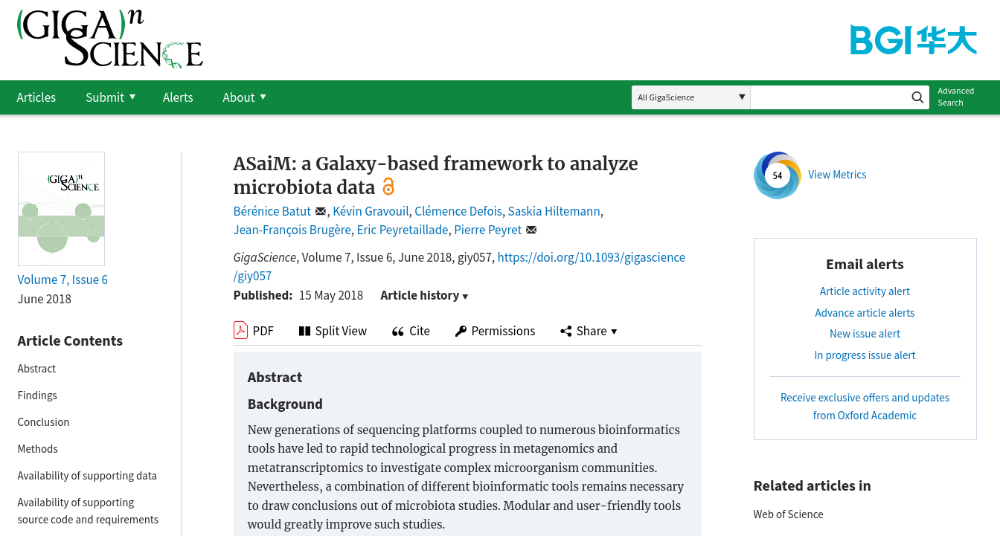 <!-- .element width="90%" -->

<small>[DIO: 10.1093/gigascience/giy057](https://academic.oup.com/gigascience/article/7/6/giy057/5001424)</small>

----
### Get a dedicated interface on the European Galaxy server

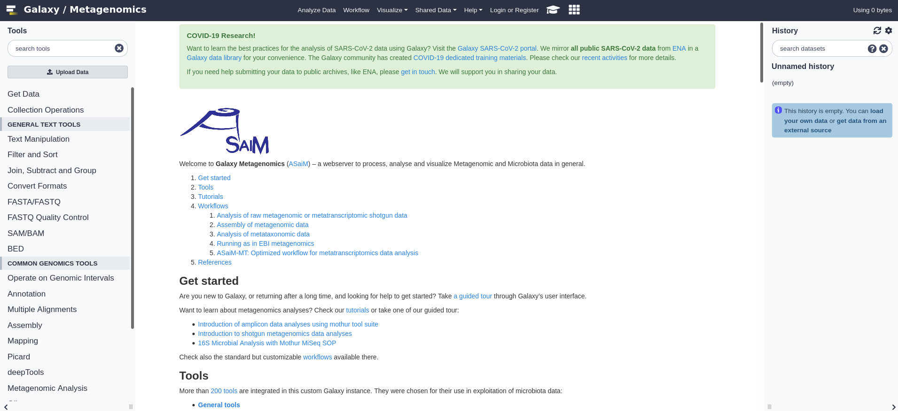 <!-- .element width="90%" -->

[microbiome.usegalaxy.eu](https://microbiome.usegalaxy.eu/)

Note:
- Dedicated interface with European Galaxy server resources
- European Galaxy server
    - Open to everyone
    - Maintained by European team leaded in Freiburg
    - 

----
### ASaiM-MT for metatranscriptomics

 <!-- .element width="65%" -->

<small>With the [Galaxy-P](http://galaxyp.org/) team - [DIO: 10.12688/f1000research.28608.2](https://f1000research.com/articles/10-103)</small>

 <!-- .element class="header_icon" -->

Note:
- Development of new training material for metatranscriptomics (with Galaxy-P)
- ASaiM-MT (with Galaxy-P): new workflow for metatranscriptomic data analysis

----
### Supporting Nanopore data

 <!-- .element class="header_icon" -->

![(1) Screenshot of tutorial "16S Microbial analysis with Nanopore data"; (2) Screenshot of NanoGalaxy toolbox with on the left on the 4 parts ("Polishing QC and preprocessing" with Porechop, Filtlong, Nanopolish, Poretools Medaka; "Genome assembly" with Minimap2, Miniasm, Racon, Fly, Unicycler, Wtdbg2, Canu; "Visualization" with Nanoplot, Bandage; "Taxonomy and metagenomics" with PlasFlow, Staramr, Kraken2); (3) Workflow starts, on the left, with File "Raw reads" / FastQ. These files are linked to 2 branches (from top to bottom): (1) yellow box "Quality control (FastQC)" --> File "QC report" --> yellow box "Report aggregation (MultiQC)"; (2) yellow box "Adapter removal (Porechop)" --> File "Trimmed reads" / FastQ --> yellow box "Sequence filtering (fastp)" --> File "QC controlled reads" / FastQ --> red box "Taxonomic classification (Kraken2)" --> File "Community profile" --> green box "Community visualization (Krona)"](images/nanogalaxy_stuff.png) <!-- .element width="80%" -->

<small>NanoGalaxy with [Willem de Koning](https://github.com/willemdek11), [Milad Miladi](http://bioinf.uni-freiburg.de/~miladim/), Saskia Hiltemann, and [Cristóbal Gallardo](https://github.com/gallardoalba)</small>

----
### Outreach: [BeerDEcoded](https://streetscience.community/projects/beerdecoded/)

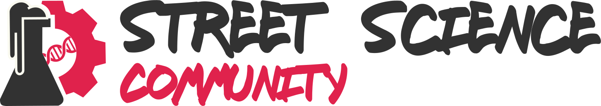 <!-- .element class="header_icon" -->

An immersion into biology, bioinformatics & sciences via beer and their yeasts

 <!-- .element width="65%" -->

- Introduction of biology and genomics to a broad audience. 
- 1-2 days (or divided over several days) practical workshops

Note:
- Street Science Community
- Funding from Mozilla mini-grants
- BeerDEcoded
    - Pupils and citizens learn about DNA, sequencing technologies, bioinformatics, open science, possible application, and the impact of all of it on everyone's life.
    - Several workshops (pupils, students, etc)

----
### Outreach: [BeerDEcoded](https://streetscience.community/projects/beerdecoded/)

 <!-- .element class="header_icon" -->

![BeerDEcoded workflow on the top. It starts on the left with "Beer" with then an arrow with "Extraction" towards "DNA", an arrow with "Sequencing" towards "DNA sequences", an arrow with "Data analysis" towards "Yeasts". From the "Extraction", an arrow goes to 2 screenshots of the "Beer DNA extraction" protocols. From the "Sequencing", an arrow goes to 2 screenshots of the "Beer DNA sequencing" protocols. From the "Data analysis", an arrow goes to a screenshot to "Beer data analysis" protocol and KRONA output on Galaxy](images/beerdecoded_stuff.png) <!-- .element width="100%" -->

<small>Protocols on [Street Science Community](https://streetscience.community) website</small>

Note:
- Development of protocols and online material
- Workflow in Galaxy
streetscience.usegalaxy.eu
Outreach: kickoff the BeerDEcoded project with the Street Science Community
Yeast DNA extraction and sequencing with MinION directly from a beer bottle
Data analysis with Galaxy

- Implementation of an online game
Workshops with schools, general audience when F2F events possible

----

<!-- .slide: data-background="images/overview_2019.png" data-background-size="contain" -->

---
<!-- .slide: data-background="images/overview_2020.png" data-background-size="contain" -->

---
<!-- .slide: data-background="images/overview_2020.png" data-background-size="contain" data-background-opacity="0.25" -->

### Towards a global Galaxy Microbiome community

Note:
2021 - Future: 
PhD student starting to work on Galaxy Microbiome

----
### Updates and additions of tools, workflows, and training

- ASaiM v2
    - Update of existing tools and workflows: HUMAnN, MetaPhlAn, QIIME2, etc
    - Implementation and benchmark of external workflows: [MGnify](https://www.ebi.ac.uk/metagenomics/), [bioBakery](https://github.com/biobakery/biobakery/wiki)

----
### bioBakery workflows

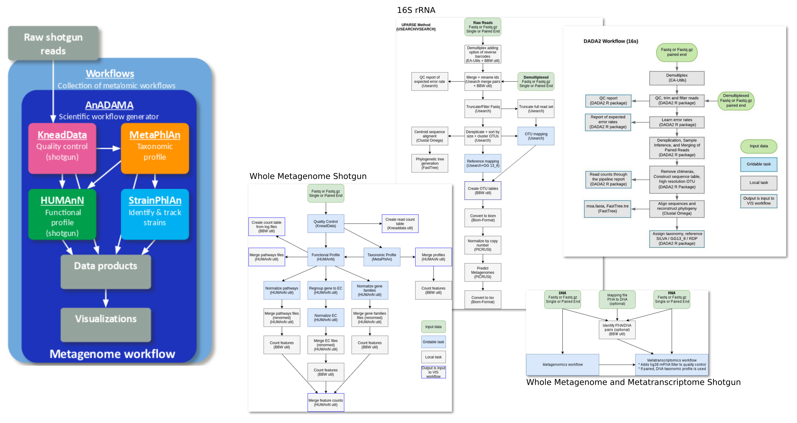 <!-- .element width="100%" -->

<small>Source: [bioBakery workflows](https://github.com/biobakery/biobakery_workflows)</small>

----
### Mgnify workflows

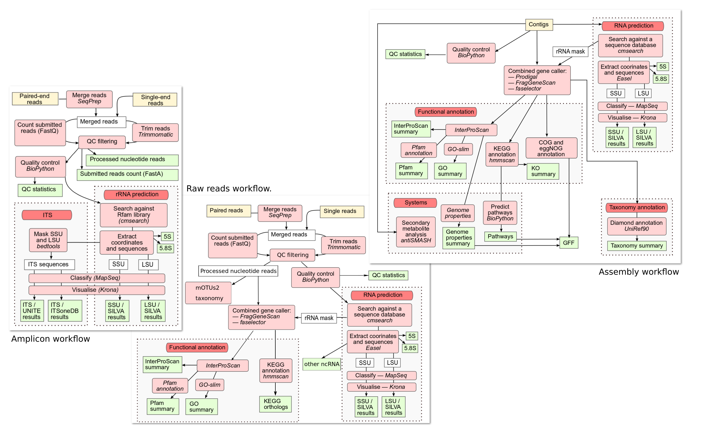 <!-- .element width="80%" -->

<small>Source: [Mgnify documentation](https://emg-docs.readthedocs.io/en/latest/analysis.html)</small>

----
### Updates and additions of tools, workflows, and training

- ASaiM v2
    - Update of existing tools and workflows: HUMAnN, MetaPhlAn, QIIME2, etc
    - Implementation and benchmark of external workflows: [MGnify](https://www.ebi.ac.uk/metagenomics/), [Biobakery](https://github.com/biobakery/biobakery/wiki)
- Integration of new [tools](https://docs.google.com/spreadsheets/d/1Nq_g-CPc8t_eC4M1NAS9XFJDflA7yE3b9hfSg3zu9L4/edit#gid=0), data sources, databases

----
### Wishlist of tools for Galaxy

 <!-- .element width="100%" -->

Note:
- Some are already there
- Non exhaustive list

----
### Updates and additions of tools, workflows, and training

- ASaiM v2
    - Update of existing tools and workflows: HUMAnN, MetaPhlAn, QIIME2, etc
    - Implementation and benchmark of external workflows: [MGnify](https://www.ebi.ac.uk/metagenomics/), [Biobakery](https://github.com/biobakery/biobakery/wiki)
- Integration of new [tools](https://docs.google.com/spreadsheets/d/1Nq_g-CPc8t_eC4M1NAS9XFJDflA7yE3b9hfSg3zu9L4/edit#gid=0), data sources, databases
- Development of new training materials and curriculum, specially via the [Gallantries](https://gallantries.github.io/)

----
### Kickoff a [global Galaxy Microbiome community](https://docs.google.com/document/d/1btaPVcrE9Hr6gLQUsqdxHKX9IvtWaWINkLZ3_NcOhe8/edit#)

- Meetings, mailing list, chat, directory of interested people
- Coordination of efforts on tool and database/data source integration, and training development
- Centralization of needs of development on Galaxy itself
- Centralization of communication efforts with other communities/groups
    - Inside Galaxy (working groups, steering committee)
    - Outside Galaxy: ubioinfo Slack, etc
- Share interesting external resources on which keeping an eye

Interested? Add yourself in this [document](https://docs.google.com/spreadsheets/d/1rI5FbAcgTfNuBuHQjwVM54dJO0EWbWWb056YAfqCZ08/edit#gid=0)

Note:
- Why?
    - Many efforts on microbiome analysis in Galaxy
    - Not so much communication between us
    - Avoiding redundant efforts

----
<!-- .slide: data-background="images/overview.png" data-background-size="contain" -->

---
<!-- .slide: data-background="images/overview.png" data-background-size="contain" data-background-opacity="0.25" -->

## ASaiM
### From a local project to a global effort to support microbiome data analysis

---
### Thank you!

 <!-- .element width="100%" -->

And many more!

---
<!-- .slide: data-background="images/overview.png" data-background-size="contain" -->
