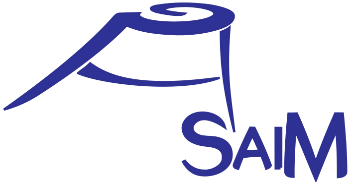
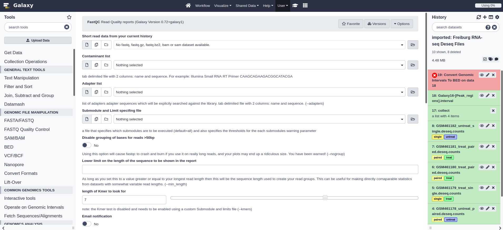
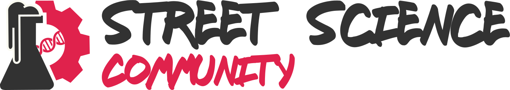

<!-- .slide: data-background="images/title.jpg" data-state="dim-background" -->
## How I developed my career  in data science
### Role models, training, mentoring and community

Bérénice Batut

<small>

University of Freiburg, Germany   
She/her - <i class="fab fa-twitter"></i> <i class="fab fa-github"></i> [@bebatut](twitter.com/bebatut) - <i class="fas fa-envelope"></i> [berenice.batut@gmail.com](mailto:berenice.batut@gmail.com)

BIM - INSA de Lyon - October 2021  
<i class="fas fa-external-link-alt"></i> [bit.ly/bebatut-bim-2021](https://bit.ly/bebatut-bim-2021)

</small>

Note:
- First of all, I would like to thank the organizers and the committee for giving me the opportunity to give the talk here

---
### How did I develop my career?

 <!-- .element width="50%" -->

Note:
- Where do I come from?
- Family
    - Eldest from 5 children
    - Privileged
    - Parents with both scientific background, long study
    - Mother
        - Passionate about her jobs and taught us the importance of work
        - Biggest role model
- Highschool
    - Know that I wanted to become a researcher
        - No relatives in research
        - No role model to relate
        - Where does it come from?

---
### What did I study?

 <!-- .element width="100%" -->

<i class="fas fa-calendar"></i> 2006-2008: 2 years of Bachelor 
 <i class="fas fa-dot-circle"></i> Mathematics & **Computer science**
 <i class="fas fa-map-marker-alt"></i> University of Lyon

<i class="fas fa-calendar"></i> 2008-2011: Master of Engineering
 <i class="fas fa-dot-circle"></i> **Bioinformatics & modelling**
 <i class="fas fa-map-marker-alt"></i> INSA Lyon

<i class="fas fa-calendar"></i> 2010-2011: Master degree
 <i class="fas fa-dot-circle"></i> Theoretical CS & **Complex system modelling**
 <i class="fas fa-map-marker-alt"></i> ENS Lyon

Note:
- 2008-2011
    - Master of Engineering - Bioinformatics and modelling - INSA Lyon
        - 14 women / 10 men
        - Learn about Python / R
    - Last year in parallel: Master degree - Theoretical computer science - Complex system modelling - ENS Lyon
        - 8 women / 30(?) men in Theoretical computer science 
        - 6 woman / 10 men in Complex system modelling
        - Difficult time but with 5 (female) friends from INSA
            - Still in contact with
            - 2 of them: almost everyday, help each others in our jobs when needed

---
### What about my PhD?

 <!-- .element width="100%" -->

<i class="fas fa-calendar"></i> 2011-2014: PhD

<i class="fas fa-dot-circle"></i> Bacterial reductive genome evolution
 2 aspects to study a same question
- ***In silico* experimental evolution**
- **Comparative genomics / phylogeny**

<i class="fas fa-map-marker-alt"></i> **Computational labs** (LBBE & LIRIS) 
 <small>INSA Lyon</small>

Note:
- 2011-2014
    - Phd student - INSA lyon
    - 2 aspects to study a same question / 2 lab
        - In silico experimental evolution
        - Comparative genomics / phylogeny
    - 4 supervisors
        - 1 women: my role model
        - 1 (male) mentor: help me structure my path in academia
    - Started to work on bigger and collaborative projects
    - Everyday
        - Often the only women
        - Did not feel discriminated
        - Learn a lot

---
### What did I do after my PhD?

 <!-- .element width="100%" -->

<i class="fas fa-calendar"></i> 2015-2016: Postdoc 

<i class="fas fa-dot-circle"></i> **Gut metagenomics**

<i class="fas fa-map-marker-alt"></i> **Wet lab** (CIDAM)
 <small>Université d'Auvergne - Clermont-Ferrand</small>

Note:
- 2015-2016
    - Postdoc - Clermont-Ferrand
        - Postdoc as bioinformatician in a biology lab
        - Alone
    - Personal aspect
        - Started to participate to computer science meetups
    - Start contributing to Open Source
        - Partner as mentor
        - New world
            - Impressive
                - Needed to push myself
                - Felt like I have nothing to provide as I was not an expert
                - Get ever my fear that people may think I have nothing to do there (did you feel it was a more opened community that other science meeting/academia ? thus helping to get involved as less depreciated ?)
                - But OSS taught me sth: I can always help, even the tiniest bit, learn step by step and get empowered to become better contributor
            - Curious
        - Galaxy
            - Job opportunity
    - Started to think about my place as a woman in the society
    - Contribution of french collaborative blog on bioinformatics

----
### Context

 <!-- .element width="70%" -->

<small>Source: [Biocomicals](http://www.biocomicals.com/ind_comicsV2.php?number=20140124)</small>

Note:
- Master in bioinformatics and computer science
- PhD in computational biology labs
- Posdoc
   - bioinformatician in a biology lab

----
### Context of my project
#### Gut microbiota

![Schema illustrating the study of gut microbiota: (1) illustration of the belly of someone with a cloud on it, full of things that looks like micro-organisms, (2) arrow that start from the cloud toward stings, with DNA/RNA written, (3) from the string, one arrow goes towards strings of letters representing sequences, (4) from the sequences one arrow goes towards 3 questions ("Who's there? What are they doing? How are they doing?"). The sequences and questions are inside a red box with on the top "Bioinformatician work" written](images/metagenomics.png) <!-- .element width="70%" -->

Note:
- Community of microorganism species that live in the digestive tracts
- Importance of gut microbiota
    - "Forgotten" organ
- 

----
### Context of my project
#### Gut microbiota: Comparative meta-omic of different project

- Public data repository: [European Nucleotide Archive (ENA)](https://www.ebi.ac.uk/ena/browser/home), [NCBI](https://www.ncbi.nlm.nih.gov/), [DNA Data Bank of Japan (DDBJ)](https://www.ddbj.nig.ac.jp/index-e.html), etc
- Source of information

    "human gut metagenome" search on ENA in 2015

    * 236 studies
    * 1,545 runs, ...

- Dispersed and not comparable information

Note: 
- For a global view
- Public data repository: Source of information

----
### Aim of my project

- Collect gut microbiota datasets in different databases
- Analyze them given a standard workflow

----
### Existing tools

*[QIIME](http://qiime.org/), [Mothur](https://mothur.org/), [MG-RAST](https://www.mg-rast.org/), [MetAMOS](https://metamos.readthedocs.io/en/v1.5rc3/), etc*

But none of them follows all the requirements:

- Analyze datasets given a standard workflow
- Use gut microbiota specific databases
- Combine user-friendly interface and command-line

Note:

few words on QIIME, Mothur

----
 <!-- .element width="50%" -->

An environment to analyze gut microbiota shotgun sequences 

- Expert database combining information from intestinal microbiota
- Modular and user-friendly framework to process and analyze microbiota sequences

----
### ASaiM framework 

- Bioinformatics framework to generate workflows for analyses of gut microbiota data
- Requirements
    - Generation of workflow with numerous tools
    - User-friendly
    - Flexibility and modularity
    - Incorporation of wanted/needed tools and databases

Note:
- Want to empower researchers in their own analysis
- Need to implement solution that they can use on their own data

----
### ASaiM framework 

What I tried 

- Simple Python scripts
- Workflow managers such as Luigi, Airflow, ...
- Homemade approach

![Illustration of the momemade approach. On the left "1. Installation of tools, databases and all dependencies" with below a circle with on the top the logo of Docker and in the circle written PRINSEQ, SortMeRNA, COG, HUMAnN, FastQ-join, MetaPhlAn. In the middle, "2. Generation of a configuration file with pipeline details via a simple Web interface" with a screenshot of the interface, an arrow that goes from the screenshot to a screenshot of a portion of a JSON file. On the right, "3. Running the pipeline via command line" with below a screenshot of 2 commands to run](images/asaim_custom.png)

Note:
- Test different workflow managers
    - Ask if they know any WF manager
    - None filling good criteria (no snakemake, nextflow back then)
- Tried to implement something based on makefile and Docker
    - Homemade approach:
        1. Installation of tools, databases and all dependencies within Docker
        2. Generation of a configuration file with pipeline details via a simple Web interface
        3. Running the pipeline via command line
    - Too cumbersome, no need to reinvent the wheel
    - Not user friendly

----
### Galaxy?

Note:

Ask if
- Who know Galaxy
- Who has already used Galaxy

----
### Galaxy?

 <!-- .element width="100%" -->

Web interface for thousands of bioinformatics tools

Note:
- more details
- No need to know about command line 
- Data
- Tools
- Wrappers
- Possible to interact programmatically with it

----
### Galaxy?

 <!-- .element width="100%" -->

Powerful workflow builder and manager

----
### Using Galaxy for ASaiM framework?

 <!-- .element width="65%" -->

<small>Source: [Biocomicals](http://www.biocomicals.com/ind_comicsV2.php?number=20120904)</small>

Note:
- In my mind back then at this time: not for bioinformatician, black box, etc
- But give it a try

----
### Using Galaxy for ASaiM framework?

Fit main requirements
- Generation of workflow with numerous tools
- User-friendly
- Flexibility and modularity
- Possibility to add wanted/needed tools and databases
- Transparency and reproducibility

Note:
- All functionality I needed for workflow
- Some tools already there (SortMeRNA, etc)
- GUI for users

----
### ASaiM framework

![Schema representing the ASaiM framework. On the left, there is a sort of workflow starting with "Raw shotgun sequence data from microbiota" --> "Data upload" --> "Input dataset" --> "Data analyses" --> "Output dataset" --> "Data download" with 4 leaves "Taxonomic information", "Functional information", "Taxonomicall-related functional information", "Comparative analysis results (taxonomy, metabolism or taxonomicall-related metabolism)". Steps from "Data upload" to "Data download" are encapsulated in a big rectangle with "Galaxy instance with a custom configuration" written on the top. 1 arrow with "using" written on it starts from "Data analyses" and goes to a box with blue background labelled "Preconfigured workflows" with 2 boxes with white background in it: (1) "Workflows to analyze raw shotgun sequences from microbiota" with 2 boxes in it: (1.1) "Metagenomic/metatranscriptomic data" with a workflow: "Quality control" --> "Dereplicate" --> 2 branches: "Assign taxonomy (MetaPhlAn)" and "Remove rRNA/rDNA (SortMeRNA) --> Analyze functions (HUMAnN)", that merge in "Combine functional and taxonomic results"; (1.2) "Amplicon data" with a workflow "Control quality" --> "Dereplicate" --> "Extract rDAN (SortMeRNA)" --> "Assign taxonomy (Mothur)"; (2) "Workflows for comparative analyses" with 4 boxes: "Taxonomy", "Gene family/pathway abundances", "GO slim term abundances", "Taxonomically related gene family/pathway abundances". An arrow (with "using" written on it) starts from the "Preconfigured workflows" box toward a another box labelled "222 selected and automatically provisionned tools, organized to help user choices" with 4 boxes insides: (1) "47 manipulation tools" with rectangles "Get Data", "Manipulate files", "Manipulate sequence files", "Manipulate BAM/SAM files"; (2) "16 preprocessing tools" with boxes "Assemble paired-end sequences", "Control quality", "vsearch tool suite", "Cluster sequences", "Sort rRNA/rDNA"; (3) "149 structural and functional analysis tools" with boxes "Map against reference genomes", "Search similarity", "Mothur tool suite", "Analyze metabolism", "Assign taxonomy for all sequence types", "Combine functional and taxonomic results"; (4) "10 visualiszation, statistics and comparative analysis tools" with boxes "Visualize data", "Compute statistics". An arrow starts from the box "222 selected and automatically provisionned tools, organized to help user choices" towards the last box labelled "Imported databases". In this box, there are 3 boxes: (1) "rRNA/rDNA" with 2 boxes "SILVA" and "Rfam"; (2) "Taxonomy" with 1 box "MetaPhlAn2 database"; (3) "Functions" with 2 boxes "ChocoPhlAn" and "UniRef50"](images/asaim_v1.png) <!-- .element width="60%" -->

Note:
- Simple Galaxy with only needed tools
- Need to do
    - Integrate missing tools that are used in the lab, and update existing ones
    - Build workflow

----
### A simplified Galaxy interface

With a comprehensive set of microbiota related tools

 <!-- .element width="70%" -->

Note:
- Simplified interface highlighting only needed tools
- Tools used locally

----
### Predefined and tested workflows

![ASaiM main workflow to analyze raw shotgun metagenomics data. It has 4 parts: PROCESSING (represented yellow boxes), TAXONOMIC ANALYSES (represented by the red boxes), FUNCTIONAL ANALYSES (represented by the purple boxes), FUNCTIONAL AND TAXONOMIC COMBINATION (represented by the green boxes). The workflow starts on the left, in PROCESSING part, from File "Raw reads" / FastQ on the left --> yellow box "Quality control (FastQC) and trimming (TrimGalore!)" --> File "Controlled reads" / Fasta --> yellow box "Dereplication (Vsearch)" --> File "Unique reads" / Fasta. The workflow branch then. (1) On the top, the TAXONOMIC ANALYSIS starts from the File "Unique reads" / Fasta --> red box "Taxonomic assignations (MetaPhlAn)" --> File "Taxa abundance" / Table --> 3 branches (from top to bottom): (1.1) red box "Visualization (GraPhlAn)" --> File "Community structure" / PNG; (1.2) red box "Visualization (KRONA)" --> File "Community structure" / HTML; (1.3) red box "Formatting for the different taxonomic levels" --> Different Files "Taxa abundance for species" / Table. 2 arrows start also from File "Taxa abundance" / Table to 2 boxes in FUNCTIONAL AND TAXONOMIC COMBINATION part. (2) On the bottom, the FUNCTIONAL ANALYSES starts from the File "Unique reads" / Fasta --> yellow box "rRNA/rDNA selection (SortMeRNA)" --> File "Non rRNA/rDNA reads" / Fasta --> purple box "Metabolic assignations (HUMAnN2)" --> 2 branches (from top to bottom): (2.1) File "Pathway abundance" / Table --> green box "Combination of taxonomic and metabolic assignations" --> File "Pathway abundance per taxa" / Table; (2.2) File "Gene family abundance" / Table --> 2 branches (from top to bottom): (2.2.1) green box "Combination of taxonomic and metabolic assignations" --> File "Gene family abundance per taxa" / Table; (2.2.2) purple box "Grouping to high level GO Slim terms" --> File "GOslim term abundance" / Table](images/asaim_main_wf.png) <!-- .element width="100%" -->

Main workflow to analyze raw shotgun metagenomics data

Note:
- Introduce HUMAMnN, MetaPhlAn

----
### An extensive documentation

<small>https://asaim.readthedocs.io</small>

Note:
- Development of a strong documentation (for users but also contributors)

----
### Behind the scene

A [GitHub organization](https://github.com/ASaiM/) with

- A repository for tools added the Galaxy Tool Shed
- A repository with Shell scripts to
    1. Get latest revision of Galaxy
    2. Prepare databases and tools
    4. Launch Galaxy
- A repository with the documentation

Note:
- Mention that was my first GitHub repos
- Help Gaalxy admin
- Not straightforward for users

Ask if anyone has contributed to Open Source

----
### Beyond ASaiM

Starting to contribute to Galaxy project

- 1st contributions to Open Source
- Update and add Galaxy tools
- Participate to community events
    - GalaxyDayFr
    - First IUC Contribution Fest on Metagenomic Hackathon
- Meet folks of the Galaxy community and in particular [Björn Grüning](https://github.com/bgruening) 

 <!-- .element class="header_icon" -->

Note:
- Opening the horizon: starting to contribute to Galaxy community
- Update and add Galaxy tools
- Events
    - GalaxyDayFr
    - First IUC Contribution Fest on Metagenomic Hackathon (Yvan, Björn, etc)
- Oportunity to meet Bjoern Gruening which offers me a job in Freiburg

----
### What did I do after my PhD?

 <!-- .element width="100%" -->

<i class="fas fa-calendar"></i> 2015-2016: Postdoc 

<i class="fas fa-dot-circle"></i> **Gut metagenomics**

<i class="fas fa-map-marker-alt"></i> **Wet lab** (CIDAM)
 <small>Université d'Auvergne - Clermont-Ferrand</small>

<i class="fas fa-lock-open"></i> 1st contributions to **Open Source**: <small>[**Galaxy**](https://galaxyproject.org/), [ASaiM](https://asaim.readthedocs.io/en/latest/), First [IUC](https://galaxyproject.org/iuc/) Contribution Fest on Metagenomic Hackathon</small>

<i class="fas fa-chalkboard-teacher"></i> **Training**: [Software Carpentry](https://software-carpentry.org/)

Participation & Talks at computer science meetups

Note:
- 2015-2016
    - Postdoc - Clermont-Ferrand
        - Postdoc as bioinformatician in a biology lab
        - Alone
    - Personal aspect
        - Started to participate to computer science meetups
    - Start contributing to Open Source
        - Partner as mentor
        - New world
            - Impressive
                - Needed to push myself
                - Felt like I have nothing to provide as I was not an expert
                - Get ever my fear that people may think I have nothing to do there (did you feel it was a more opened community that other science meeting/academia ? thus helping to get involved as less depreciated ?)
                - But OSS taught me sth: I can always help, even the tiniest bit, learn step by step and get empowered to become better contributor
            - Curious
        - Galaxy
            - Job opportunity
    - Started to think about my place as a woman in the society
    - Contribution of french collaborative blog on bioinformatics

---
### What do I do now?

 

<i class="fas fa-calendar"></i> 2016-now: Postdoc 

<i class="fas fa-map-marker-alt"></i> [Freiburg Galaxy Team](https://galaxyproject.eu/freiburg/)
 <small>[Bioinformatic / Backofen Lab](http://www.bioinf.uni-freiburg.de/)
 University of Freiburg - [de.NBI](https://www.denbi.de/) - [ELIXIR](https://elixir-europe.org/) Germany</small>

<i class="fas fa-dot-circle"></i> **Data analyses** & **Tool development**
 <small>Microbiome, RNA-seq, etc
 [ASaiM](https://asaim.readthedocs.io/en/latest/), [Galaxy](https://galaxyproject.org/), Python, etc</small>

<i class="fas fa-chalkboard-teacher"></i> **Training**, <i class="fas fa-hands-helping"></i> **Mentoring** & <i class="fas fa-users"></i> **Community**
 <small>[Galaxy Training Network](https://training.galaxyproject.org/), [Gallantries](https://gallantries.github.io/), [ELIXIR Training Platform](https://elixir-europe.org/platforms/training), [Open Life Science](https://openlifesci.org/), [Street Science Community](https://streetscience.community/)</small>

Note:
- 2016-now
    - Postdoc - Freiburg Galaxy team with Björn Grüning
    - de.NBI / ELIXIR
    - Gave up on idea to become Professor
    - Data analysis: RNA-seq, Microbiome - ASaiM
    - Tool development: Microbiome, Galaxy
    - Training, mentoring, community building

---
### <i class="fas fa-dot-circle"></i> Data analyses

 <!-- .element width="40%" -->

----
### Atlas of Microglia-Microbiota in Aging

 <!-- .element width="50%" -->

----
### Atlas of Microglia-Microbiota in Aging

 <!-- .element width="70%" -->

---
### <i class="fas fa-chalkboard-teacher"></i> Training

 <!-- .element width="40%" -->

Note:

Involvement in different training communities

- ELIXIR Training Platform
    - ELIXIR-DE deputy training coordinator
    - ELIXIR TtT
- The Carpentries → Gallantries
- Life science Trainers

----
### Galaxy Training Network for  data analysis training

 <!-- .element class="header_icon" -->

An **online & open infrastructure** to empower scientists and instructors
- [training.galaxyproject.org](https://training.galaxyproject.org/): 210+ tutorials in 20+ topics
- Computational resources: Data / Tools / Servers / TIaaS

A growing **community**
- Thousands of students
- 180+ contributors
- Community events

Note:
- Start to build an online training infrastructure for the Galaxy community
    - Rewamp GTN
    - Strengthen the community with events
- Teaching to empower 
    - users in their analysis
    - new contributors
- Big efforts to learn from different experiences
- ~40K visitors per months

----
### BeerDEcoded for popularization of science

 <!-- .element class="header_icon" -->

![BeerDEcoded workflow on the top. It starts on the left with "Beer" with then an arrow with "Extraction" towards "DNA", an arrow with "Sequencing" towards "DNA sequences", an arrow with "Data analysis" towards "Yeasts". From the "Extraction", an arrow goes to 2 screenshots of the "Beer DNA extraction" protocols. From the "Sequencing", an arrow goes to 2 screenshots of the "Beer DNA sequencing" protocols. From the "Data analysis", an arrow goes to a screenshot to "Beer data analysis" protocol and KRONA output on Galaxy](images/beerdecoded_stuff.png)

An **immersion** into biology, bioinformatics & sciences via beer and their yeasts

Introduction of biology and genomics to a **broad audience**

1-2 days (or divided over several days) **practical workshops**

Detailed & illustrated **protocols** on [Street Science Community](https://streetscience.community) website

Note:
- Reaching people everywhere
- Showing what is research
- Street Science Community
- Funding from Mozilla mini-grants
- BeerDEcoded
    - Pupils and citizens learn about DNA, sequencing technologies, bioinformatics, open science, possible application, and the impact of all of it on everyone's life.
    - Several workshops (pupils, students, etc)

---
### <i class="fas fa-hands-helping"></i> Mentoring

 <!-- .element width="40%" -->

Note:
- Mozilla Open Leaders
    - Participant
        - Opened my eyes on many things 
    - Mentor: Anne → Galaxy for Climate
- The Carpentries
- GTN

----
### Open Life Science = Training + Mentoring

 <!-- .element class="header_icon" -->

 

 <!-- .element width="85%" -->

A 16-week long **personal mentorship** and **cohort-based training** for **Open Science ambassadors**

- OLS-1: 29 participants / 20 projects / 20 mentors / 40+ experts
- OLS-2: 52 participants / 32 projects / 36 mentors / 60+ experts
- OLS-3: 65 participants / 37 projects / 34 mentors / 60+ experts
- OLS-4 (Sep - Jan 2021): **Registration open on [openlifesci.org](https://openlifesci.org/)**

Note:

- A 16-week program
    - 3 cohorts - .. participants - … mentors - … experts
    - Open Science
    - Community building
    - Inclusivity, Empowerment
- Pathways : participants → mentor, experts
- Efforts to choose speakers: women, minorities, entire worlds
- More than just mentoring, a community
    - … members
    - Active Slack with messages everydays
        - Resources
        - Events
        - Job offers
    - Ally skills
    - Developing research oriented topic

----
### Outreachy

Internships in **open source**
- Interns
    - People subject to systemic bias and impacted by underrepresentation in the technical industry where they are living
    - Paid ($6,000 USD)
    - Remote
    - 3 months 
- Offered projects: Establish a Galaxy Mentor Network

[outreachy.org](https://www.outreachy.org/)

---
### <i class="fas fa-users"></i> Community

 <!-- .element width="40%" -->

Note:
Add more logos (microbiome, science, education)

- Involved in different communities
- Learn a lot from them but also the Mozilla Open leaders
- Inclusivity, empowering, pathways, 

Involved in Different communities
GTN
OLS
Street Science Community
Microbiome Galaxy

----
### microGalaxy

The place to go for anything microbiology in Galaxy! 

- Topics
    - Microbiome samples, bacterial isolates, etc
    - Long, short reads
    - Genomics, transcriptomics, proteomics, etc
- Resources
    - Tools (and whishlist)
    - Workflows
    - Training material
- Community
    - Chat
    - Quaterly meetings

---
### How does a typical week look like for me?

 <!-- .element width="100%" -->

---
### What did I learn?

 

 <!-- .element width="80%" -->

- Contributing to **openness** can be **frightening** at beginning
- **Mentors** are crucial for all aspects of my life but most important for helping me going **out of my comfort zone** and over my fears
- **Role models**
    - helped me to **project** and to know my possibilities
    - may change overtime: we should **focus on values and traits over people**

Note:

- Contributing to openness can be frightening at beginning
    - I know many people struggle on the openness ...
        - Writing on public issues, in chat rooms
        - contributing code publically
- Mentors are crucial for all aspects of my life but most important for encourage me to go out of my comfort zone and over my fears
    - What about the big topic of self-confidence?
    - anything that you would recommend to others to deal with low self-confidence?
    - what should shy people do?
    - can people that don't like to talk survive in science and build a carear?

    Find a project, community in which you can be mentored, taken step-by-step and empower

- Role models
    - helped me to project and to know my possibilities
    - may change overtime: we should focus on values and traits over people

----
### What did I learn?

 

 <!-- .element width="80%" -->

- People and **communities**
    - made me **reflect on my position and my privileges**
    - got me more familiar with **discrimination and biases**
    - provided insights and solutions for more **accessible, inclusive** communities and resources
- **Sisterhood** helps me in my everyday life

Note:
- People and communities
    - made me reflect on my position and my privileges
    - got me more familiar with discrimination and biases
    - provided insights and solutions for more accessible, inclusive communities and resources
- Sisterhood helps me in my everyday life

---
### What would I like to do in the future?

 

 <!-- .element width="80%" -->

- Analyze data & develop tools
- Keep giving training & building sustainable & accessible training infrastructures
- Participate, sustain & build communities
- Mentor & supervise women
- Participate in initiatives like "Girls in Science"
- Be a role model
- Share my experience
- Keep learning from others!

Note:

- Keep giving training & build sustainable and accessible training infrastructures
    - Not only for rich European but also projects like B3Africa
- I do not feel special. My path is quite "basics" but it is a way to show that it is possible

---
### Thank You!

 <!-- .element width="100%" -->