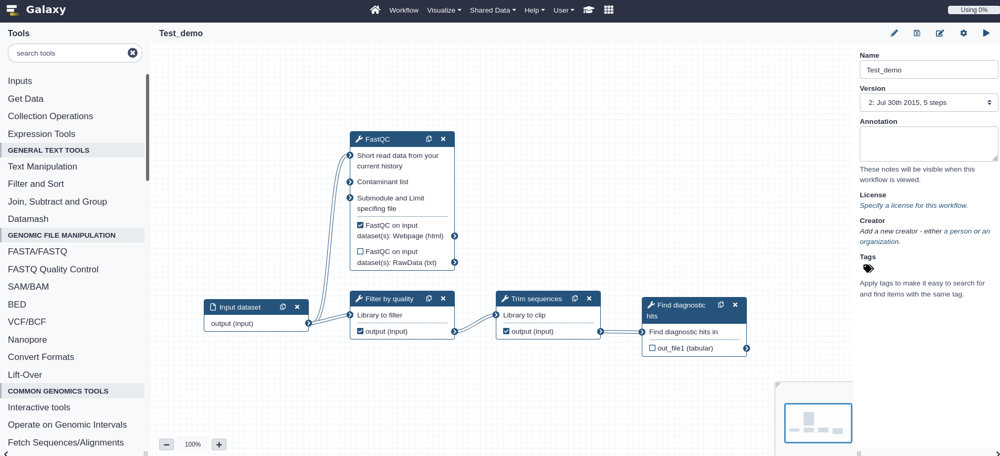

<!-- .slide: data-background="images/title.jpg" data-state="dim-background" -->
## Galaxy for Microbiome

 

Bérénice Batut

<small>University of Freiburg, Germany   She/her - <i class="fab fa-twitter"></i> <i class="fab fa-github"></i> [@bebatut](twitter.com/bebatut) - <i class="fas fa-envelope"></i> berenice.batut@gmail.com</small>

 

<small>Analysis of Functions Expressed by Microbiomes - Online Workshop - November 2021</small>

<small style="position: absolute; right: 0%; font-size: 0.2em; bottom: -20%;">Photo by [Elena Mozhvilo](https://unsplash.com/@miracleday?utm_source=unsplash&utm_medium=referral&utm_content=creditCopyText) on [Unsplash](https://unsplash.com/?utm_source=unsplash&utm_medium=referral&utm_content=creditCopyText) </small>
  

Note:
- First of all, I would like to thank the organizers and the committee for giving me the opportunity to give the talk here

---
<!-- .slide: data-background="images/back.jpg" data-state="dim-background" -->

## Back in 2015

<small style="position: absolute; right: 0%; font-size: 0.2em; bottom: -20%;">Photo by [Andy Beales](https://unsplash.com/@andybeales?utm_source=unsplash&utm_medium=referral&utm_content=creditCopyText) on [Unsplash](https://unsplash.com/s/photos/time-travel?utm_source=unsplash&utm_medium=referral&utm_content=creditCopyText) </small>
  

----
### Context: Gut microbiota

![Schema illustrating the study of gut microbiota: (1) illustration of the belly of someone with a cloud on it, full of things that looks like micro-organisms, (2) arrow that start from the cloud toward stings, with DNA/RNA written, (3) from the string, one arrow goes towards strings of letters representing sequences, (4) from the sequences one arrow goes towards 3 questions ("Who's there? What are they doing? How are they doing?"). The sequences and questions are inside a red box with on the top "Bioinformatician work" written](images/metagenomics.png) <!-- .element width="70%" -->

Note:
- Community of microorganism species that live in the digestive tracts
- Importance of gut microbiota
    - "Forgotten" organ
- 

----
### Aim of the project

- Collect gut microbiota datasets in different databases
- Analyze them given a standard workflow

----
### Existing tools

*[QIIME](http://qiime.org/), [Mothur](https://mothur.org/), [MG-RAST](https://www.mg-rast.org/), [MetAMOS](https://metamos.readthedocs.io/en/v1.5rc3/), etc*

But none of them follows all the requirements:

- Analyze datasets given a standard workflow
- Combine user-friendly interface and command-line

Note:

few words on QIIME, Mothur

----
 <!-- .element width="50%" -->

An environment to analyze gut microbiota shotgun sequences 

- Expert database combining information about intestinal microbiota from different databases
- Modular and user-friendly framework to process and analyze microbiota sequences

----
### ASaiM framework 

- Bioinformatics framework to generate workflows for analyses of gut microbiota data
- Requirements
    - Generation of workflow with numerous tools
    - User-friendly
    - Flexibility and modularity
    - Incorporation of wanted/needed tools and databases

Note:
- Want to empower researchers in their own analysis
- Need to implement solution that they can use on their own data

----
### Galaxy?

 <!-- .element width="100%" -->

Web interface for thousands of bioinformatics tools

Note:
- more details
- No need to know about command line 
- Data
- Tools
- Wrappers
- Possible to interact programmatically with it

----
### Galaxy?

 <!-- .element width="100%" -->

Powerful workflow builder and manager

----
### Using Galaxy for ASaiM framework?

 <!-- .element width="65%" -->

<small>Source: [Biocomicals](http://www.biocomicals.com/ind_comicsV2.php?number=20120904)</small>

Note:
- In my mind back then at this time: not for bioinformatician, black box, etc
- But give it a try

----
### Using Galaxy for ASaiM framework?

Fit main requirements
- Generation of workflow with numerous tools
- User-friendly
- Flexibility and modularity
- Possibility to add wanted/needed tools and databases
- Transparency and reproducibility

Note:
- All functionality I needed for workflow
- Some tools already there (SortMeRNA, etc)
- GUI for users

----
### ASaiM framework

![Schema representing the ASaiM framework. On the left, there is a sort of workflow starting with "Raw shotgun sequence data from microbiota" --> "Data upload" --> "Input dataset" --> "Data analyses" --> "Output dataset" --> "Data download" with 4 leaves "Taxonomic information", "Functional information", "Taxonomicall-related functional information", "Comparative analysis results (taxonomy, metabolism or taxonomicall-related metabolism)". Steps from "Data upload" to "Data download" are encapsulated in a big rectangle with "Galaxy instance with a custom configuration" written on the top. 1 arrow with "using" written on it starts from "Data analyses" and goes to a box with blue background labelled "Preconfigured workflows" with 2 boxes with white background in it: (1) "Workflows to analyze raw shotgun sequences from microbiota" with 2 boxes in it: (1.1) "Metagenomic/metatranscriptomic data" with a workflow: "Quality control" --> "Dereplicate" --> 2 branches: "Assign taxonomy (MetaPhlAn)" and "Remove rRNA/rDNA (SortMeRNA) --> Analyze functions (HUMAnN)", that merge in "Combine functional and taxonomic results"; (1.2) "Amplicon data" with a workflow "Control quality" --> "Dereplicate" --> "Extract rDAN (SortMeRNA)" --> "Assign taxonomy (Mothur)"; (2) "Workflows for comparative analyses" with 4 boxes: "Taxonomy", "Gene family/pathway abundances", "GO slim term abundances", "Taxonomically related gene family/pathway abundances". An arrow (with "using" written on it) starts from the "Preconfigured workflows" box toward a another box labelled "222 selected and automatically provisionned tools, organized to help user choices" with 4 boxes insides: (1) "47 manipulation tools" with rectangles "Get Data", "Manipulate files", "Manipulate sequence files", "Manipulate BAM/SAM files"; (2) "16 preprocessing tools" with boxes "Assemble paired-end sequences", "Control quality", "vsearch tool suite", "Cluster sequences", "Sort rRNA/rDNA"; (3) "149 structural and functional analysis tools" with boxes "Map against reference genomes", "Search similarity", "Mothur tool suite", "Analyze metabolism", "Assign taxonomy for all sequence types", "Combine functional and taxonomic results"; (4) "10 visualiszation, statistics and comparative analysis tools" with boxes "Visualize data", "Compute statistics". An arrow starts from the box "222 selected and automatically provisionned tools, organized to help user choices" towards the last box labelled "Imported databases". In this box, there are 3 boxes: (1) "rRNA/rDNA" with 2 boxes "SILVA" and "Rfam"; (2) "Taxonomy" with 1 box "MetaPhlAn2 database"; (3) "Functions" with 2 boxes "ChocoPhlAn" and "UniRef50"](images/asaim_v1.png) <!-- .element width="60%" -->

Note:
- Simple Galaxy with only needed tools
- Need to do
    - Integrate missing tools that are used in the lab, and update existing ones
    - Build workflow

----
### A simplified Galaxy interface

With a comprehensive set of microbiota related tools

 <!-- .element width="70%" -->

Note:
- Simplified interface highlighting only needed tools
- Tools used locally

----
### Predefined and tested workflows

![ASaiM main workflow to analyze raw shotgun metagenomics data. It has 4 parts: PROCESSING (represented yellow boxes), TAXONOMIC ANALYSES (represented by the red boxes), FUNCTIONAL ANALYSES (represented by the purple boxes), FUNCTIONAL AND TAXONOMIC COMBINATION (represented by the green boxes). The workflow starts on the left, in PROCESSING part, from File "Raw reads" / FastQ on the left --> yellow box "Quality control (FastQC) and trimming (TrimGalore!)" --> File "Controlled reads" / Fasta --> yellow box "Dereplication (Vsearch)" --> File "Unique reads" / Fasta. The workflow branch then. (1) On the top, the TAXONOMIC ANALYSIS starts from the File "Unique reads" / Fasta --> red box "Taxonomic assignations (MetaPhlAn)" --> File "Taxa abundance" / Table --> 3 branches (from top to bottom): (1.1) red box "Visualization (GraPhlAn)" --> File "Community structure" / PNG; (1.2) red box "Visualization (KRONA)" --> File "Community structure" / HTML; (1.3) red box "Formatting for the different taxonomic levels" --> Different Files "Taxa abundance for species" / Table. 2 arrows start also from File "Taxa abundance" / Table to 2 boxes in FUNCTIONAL AND TAXONOMIC COMBINATION part. (2) On the bottom, the FUNCTIONAL ANALYSES starts from the File "Unique reads" / Fasta --> yellow box "rRNA/rDNA selection (SortMeRNA)" --> File "Non rRNA/rDNA reads" / Fasta --> purple box "Metabolic assignations (HUMAnN2)" --> 2 branches (from top to bottom): (2.1) File "Pathway abundance" / Table --> green box "Combination of taxonomic and metabolic assignations" --> File "Pathway abundance per taxa" / Table; (2.2) File "Gene family abundance" / Table --> 2 branches (from top to bottom): (2.2.1) green box "Combination of taxonomic and metabolic assignations" --> File "Gene family abundance per taxa" / Table; (2.2.2) purple box "Grouping to high level GO Slim terms" --> File "GOslim term abundance" / Table](images/asaim_main_wf.png) <!-- .element width="100%" -->

Main workflow to analyze raw shotgun metagenomics data

Note:
- Introduce HUMAMnN, MetaPhlAn

----
### An extensive documentation

<small>https://asaim.readthedocs.io</small>

Note:
- Development of a strong documentation (for users but also contributors)

---
<!-- .slide: data-background="images/global.jpg" data-state="dim-background" -->

## Beyond a local effort on gut microbiota analyses

<small style="position: absolute; right: 0%; font-size: 0.2em; bottom: -20%;">Photo by [Brett Zeck](https://unsplash.com/@iambrettzeck?utm_source=unsplash&utm_medium=referral&utm_content=creditCopyText) on [Unsplash](https://unsplash.com/s/photos/global?utm_source=unsplash&utm_medium=referral&utm_content=creditCopyText)</small>

----
### 300+ tools for microbiome analysis

- **Microbial**: Scoary, Prokka, Roary
- **Metagenomics data manipulation**: VSearch, Nonpareil, DADA2
- **Assembly**: MEGAHIT, metaSPAdes, metaQUAST, VALET, Bandage, MaxBin2
- **Metataxonomic sequence analysis**: Mothur, QIIME, Vegan
- **Taxonomy assignation**: MetaPhlAn, Kraken, CAT/BAT
- **Metabolism assignation**: HUMAnN, PICRUST, InterProScan
- **Visualization**: Export2graphlan, GraPhlAn, KRONA
- **Metaproteomics**: MaxQuant, SearchGUI, PeptideShaker, Unipep
- ...

----
### Metagenomic assembly 

- Integration of tools
    - metagenomic assembly tools: MEGAHIT, MetaSPAdes, etc
    - assembly quality tools: MetaQUAST, VALET, etc
- Build workflows for metagenomic assembly 

![ASaiM workflow to assemble metagenomic data. It has 4 parts with 4 colors (yellow, red, green, purple). The workflow starts, on the left, with 2 Files "Forward raw reads" / FastQ 6 "Reverse raw reads" / FastQ. These files are linked to 2 branches (from top to bottom): (1) yellow box "Quality control (FastQC)" --> 2 output Files "QC report for forward" / Text & "QC report for reverse" / Text --> purple box "Report aggregation (MultiQC)"; (2) yellow box "Quality cleaning (TrimGalore!)" --> 2 outputs Files "Forward controlled reads" / Fasta & "Reverse controlled reads" / Fasta --> 3 branches: (2.1) red box "Assembly (metaSPAdes/MEGAHIT)" --> 2 outputs Files "Scaffolds" / Fasta & "Contigs" / Fasta --> green box "Quality assessment (MetaQUAST)" --> File "Report" --> purple box "Report aggregation (MultiQC)"; (2.2) green box "Validation (VALET)" with also File "Contigs" / Fasta as input --> File "Report"; (2.3) green box "Mapping on original reads (Bowtie2)" with also File "Contigs" / Fasta as input --> File "Mapping stats" --> purple box "Report aggregation (MultiQC)"](images/assembly_wf.png) <!-- .element width="80%" -->

Note:
- Started like an internal project for CRISPR subtype discovery
- Not Galaxy originally
- Difficulties with compute resources
- Integration of metagenomic assembly tools into Bioconda and Galaxy

----
### ASaiM-MT for metatranscriptomics

 <!-- .element width="70%" -->

<small>With the [Galaxy-P](http://galaxyp.org/) team - [DIO: 10.12688/f1000research.28608.2](https://f1000research.com/articles/10-103)</small>

 <!-- .element class="header_icon" -->

Note:
- Development of new training material for metatranscriptomics (with Galaxy-P)
- ASaiM-MT (with Galaxy-P): new workflow for metatranscriptomic data analysis

----
### Supporting Nanopore data

 <!-- .element class="header_icon" -->

![(1) Screenshot of tutorial "16S Microbial analysis with Nanopore data"; (2) Screenshot of NanoGalaxy toolbox with on the left on the 4 parts ("Polishing QC and preprocessing" with Porechop, Filtlong, Nanopolish, Poretools Medaka; "Genome assembly" with Minimap2, Miniasm, Racon, Fly, Unicycler, Wtdbg2, Canu; "Visualization" with Nanoplot, Bandage; "Taxonomy and metagenomics" with PlasFlow, Staramr, Kraken2); (3) Workflow starts, on the left, with File "Raw reads" / FastQ. These files are linked to 2 branches (from top to bottom): (1) yellow box "Quality control (FastQC)" --> File "QC report" --> yellow box "Report aggregation (MultiQC)"; (2) yellow box "Adapter removal (Porechop)" --> File "Trimmed reads" / FastQ --> yellow box "Sequence filtering (fastp)" --> File "QC controlled reads" / FastQ --> red box "Taxonomic classification (Kraken2)" --> File "Community profile" --> green box "Community visualization (Krona)"](images/nanogalaxy_stuff.png) <!-- .element width="80%" -->

<small>NanoGalaxy with [Willem de Koning](https://github.com/willemdek11), [Milad Miladi](http://bioinf.uni-freiburg.de/~miladim/), Saskia Hiltemann, and [Cristóbal Gallardo](https://github.com/gallardoalba)</small>

----

### Online and community supported  training material

 <!-- .element width="90%" -->

<small>[training.galaxyproject.org/topics/metagenomics](training.galaxyproject.org/topics/metagenomics)</small>

Note:
- GTN
- Developped with the help of the Galaxy Training Network (GTN)
- Hosted in the GTN website

----

### Online and community supported  training material

 <!-- .element width="70%" -->

<small>[training.galaxyproject.org/topics/metagenomics](training.galaxyproject.org/topics/metagenomics)</small>

Note:
- http://galaxyproject.github.io/training-material/metagenomics
- 16S with Mothur
- Analyses of metagenomics data

----
### A dedicated interface on the  European Galaxy server

 <!-- .element width="90%" -->

[microbiome.usegalaxy.eu](https://microbiome.usegalaxy.eu/)

Note:
- Dedicated interface with European Galaxy server resources
- European Galaxy server
    - Open to everyone
    - Maintained by European team leaded in Freiburg

----
### microGalaxy community

 <!-- .element class="header_icon" -->

The place to go for anything microbiology in Galaxy! 

- Quaterly meetings
- Discussion via chat
- A dedicated page to share workflows, training, tools, resources with everyone

[microgalaxy.usegalaxy.eu](https://microgalaxy.usegalaxy.eu/)

---
<!-- .slide: data-background="images/cloud.jpg" data-state="dim-background" -->

## Multi-omics data analysis of a newly studied environment
### The clouds

 <!-- .element class="header_icon" -->

<small style="position: absolute; right: 0%; font-size: 0.2em; bottom: -20%;">Photo by [Dallas Reedy](https://unsplash.com/@dallasreedy?utm_source=unsplash&utm_medium=referral&utm_content=creditCopyText) on [Unsplash](https://unsplash.com/s/photos/cloud?utm_source=unsplash&utm_medium=referral&utm_content=creditCopyText)</small>

----
### Clouds as microbial oasis

- Important diversity of microorganisms in clouds
- With some really active microorganisms

 <!-- .element width="50%" -->

<small>[Amato et al, 2019](https://www.nature.com/articles/s41598-019-41032-4)</small>

Note:

Schematic summary of the main probable impacts of microbial activity on cloud processes, based on coordinated metagenomics/metatranscriptomics. Biological processes and their targets are indicated by green arrows, while red arrows indicate abiotic processes. EPS: Exopolysaccharide; SOA: Secondary organic aerosol.

----
### Biological data from clouds in new climate models?

But first need to characterize:

- What are the biological and functional diversities in clouds and the outdoor atmosphere (aerosols)
- What are the difference between clouds and aerosols

 <!-- .element width="60%" -->

----
### Methodology

----
<!-- .slide: data-background="images/puy_dome.jpg" data-state="dim-background" -->
### Cloud and aerosol sampling

On the top of the Puy de Dôme Mountain (1465m a.s.l.), France

----
### Metagenomics and metatranscriptomics

 <!-- .element width="70%" -->

----
### Data analysis using ASaiM?

![ASaiM main workflow to analyze raw shotgun metagenomics data. It has 4 parts: PROCESSING (represented yellow boxes), TAXONOMIC ANALYSES (represented by the red boxes), FUNCTIONAL ANALYSES (represented by the purple boxes), FUNCTIONAL AND TAXONOMIC COMBINATION (represented by the green boxes). The workflow starts on the left, in PROCESSING part, from File "Raw reads" / FastQ on the left --> yellow box "Quality control (FastQC) and trimming (TrimGalore!)" --> File "Controlled reads" / Fasta --> yellow box "Dereplication (Vsearch)" --> File "Unique reads" / Fasta. The workflow branch then. (1) On the top, the TAXONOMIC ANALYSIS starts from the File "Unique reads" / Fasta --> red box "Taxonomic assignations (MetaPhlAn)" --> File "Taxa abundance" / Table --> 3 branches (from top to bottom): (1.1) red box "Visualization (GraPhlAn)" --> File "Community structure" / PNG; (1.2) red box "Visualization (KRONA)" --> File "Community structure" / HTML; (1.3) red box "Formatting for the different taxonomic levels" --> Different Files "Taxa abundance for species" / Table. 2 arrows start also from File "Taxa abundance" / Table to 2 boxes in FUNCTIONAL AND TAXONOMIC COMBINATION part. (2) On the bottom, the FUNCTIONAL ANALYSES starts from the File "Unique reads" / Fasta --> yellow box "rRNA/rDNA selection (SortMeRNA)" --> File "Non rRNA/rDNA reads" / Fasta --> purple box "Metabolic assignations (HUMAnN2)" --> 2 branches (from top to bottom): (2.1) File "Pathway abundance" / Table --> green box "Combination of taxonomic and metabolic assignations" --> File "Pathway abundance per taxa" / Table; (2.2) File "Gene family abundance" / Table --> 2 branches (from top to bottom): (2.2.1) green box "Combination of taxonomic and metabolic assignations" --> File "Gene family abundance per taxa" / Table; (2.2.2) purple box "Grouping to high level GO Slim terms" --> File "GOslim term abundance" / Table](images/asaim_main_wf.png) <!-- .element width="100%" -->

----
### Taxonomic profiling with MetaPhlAn 

 <!-- .element width="100%" -->

----
### Taxonomic profiling with MetaPhlAn 

 <!-- .element width="100%" -->

----
### Taxonomic profiling with MetaPhlAn vs Kraken

 <!-- .element width="100%" -->

----
### Need to change the workflow

- Human sequences to filter
- Missing some reference in MetaPhlAn database

----
### Data preparation

 <!-- .element width="100%" -->

----
### Taxonomic profiling

 <!-- .element width="60%" -->

----
### Functional profiling

 <!-- .element width="50%" -->

<small>[Salazar et al, 2019](https://www.sciencedirect.com/science/article/pii/S009286741931164X)</small>

Note:

- A global survey of gene and transcript collections from ocean microbial communities
- Reveal the differential role of organismal composition and gene expression in the adjestement of ocean microbial communities to environmental change

Outputs

- A catalog of 47 million genes was generated from 370 globally distributed metagenomes
- Meta-omics data integration disentangled the mechanisms of changes in transcript pools
- Transcript pool changes of metabolic marker genes show distinct mechanistic patterns
- Community turnover as a response to ocean warming may be strongest in polar regions

----
### Generation and annotation of a  Reference Gene Catalog

 <!-- .element width="100%" -->

----
### Gene and transcript profiling

![Transcript Abundance Profile as a Function of Community Composition and Gene Expression. Cartoon exemplifying how an initial community with a given expression profile may result insimilar transcript abundance profiles through two different mechanisms: (i) changes in the community composition (upper arrow), represented by three different species (green, red, and blue), or (ii) changes in gene expression (lower arrow), represented by two different genes (purple and orange, with low and high expression levels, respectively).](images/salazar2019_figs1.jpg) <!-- .element width="90%" -->

<small>[Salazar et al, 2019](https://www.sciencedirect.com/science/article/pii/S009286741931164X)</small>

Note:

Transcript Abundance Profile as a Function of Community Composition and Gene Expression. Cartoon exemplifying how an initial community with a given expression profile may result insimilar transcript abundance profiles through two different mechanisms: (i) changes in the community composition (upper arrow), represented by three different species (green, red, and blue), or (ii) changes in gene expression (lower arrow), represented by two different genes (purple and orange, with low and high expression levels, respectively).

----
### Gene and transcript profiling

![Derivation of the Decomposition of a Metatranscriptome. Mathematical basis for (A and B) the within-sample decomposition of metatranscriptomes (transcript copies / cell) into abundance (gene copies / cell) and expression (transcript copies / gene copy) components, and for (C) the between-sample decomposition of the Euclidean distance between metatranscriptomes (transcript abundance differences) into the abundance component (gene abundance differences), the expression component (expression differences), and an interaction term (abundance - expression covariation). ](images/salazar2019_figs7.jpg) <!-- .element width="60%" -->

<small>[Salazar et al, 2019](https://www.sciencedirect.com/science/article/pii/S009286741931164X)</small>

Note:

Derivation of the Decomposition of a Metatranscriptome. 

Mathematical basis for (A and B) the within-sample decomposition of metatranscriptomes (transcript copies / cell) into abundance (gene copies / cell) and expression (transcript copies / gene copy) components, and for (C) the between-sample decomposition of the Euclidean distance between metatranscriptomes (transcript abundance differences) into the abundance component (gene abundance differences), the expression component (expression differences), and an interaction term (abundance - expression covariation). 

----
### Gene and transcript profiling

 <!-- .element width="100%" -->

----
### Statistical analyses

 <!-- .element width="100%" -->

----
### Results?

<!-- .slide: data-background="images/processing.jpg" data-state="dim-background" -->

<small style="position: absolute; right: 0%; font-size: 0.2em; bottom: -20%;">Photo by Digital Buggu from Pexels</small>

---
<!-- .slide: data-background="images/title.jpg" data-state="dim-background" -->

## Galaxy for Microbiome

Everything you need to analyze your microbiome data!

- <i class="fas fa-tools"></i> Tools
- <i class="fas fa-sitemap"></i> Workflows
- <i class="fas fa-graduation-cap"></i> Training
- <i class="fas fa-users"></i> Community

If not, let's see what we can do together!

<small style="position: absolute; right: 0%; font-size: 0.2em; bottom: -20%;">Photo by [Elena Mozhvilo](https://unsplash.com/@miracleday?utm_source=unsplash&utm_medium=referral&utm_content=creditCopyText) on [Unsplash](https://unsplash.com/?utm_source=unsplash&utm_medium=referral&utm_content=creditCopyText) </small>

---
### Thank you!

 <!-- .element width="100%" -->

And many more!

---
<!-- .slide: data-background="images/title.jpg" data-state="dim-background" -->

## Galaxy for Microbiome

Everything you need to analyze your microbiome data!

- <i class="fas fa-tools"></i> Tools
- <i class="fas fa-sitemap"></i> Workflows
- <i class="fas fa-graduation-cap"></i> Training
- <i class="fas fa-users"></i> Community

If not, let's see what we can do together!

<small style="position: absolute; right: 0%; font-size: 0.2em; bottom: -20%;">Photo by [Elena Mozhvilo](https://unsplash.com/@miracleday?utm_source=unsplash&utm_medium=referral&utm_content=creditCopyText) on [Unsplash](https://unsplash.com/?utm_source=unsplash&utm_medium=referral&utm_content=creditCopyText) </small>

